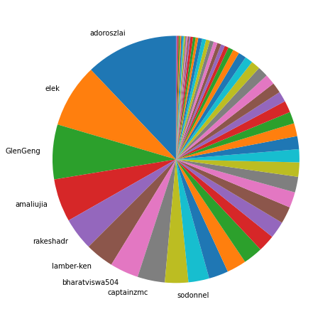
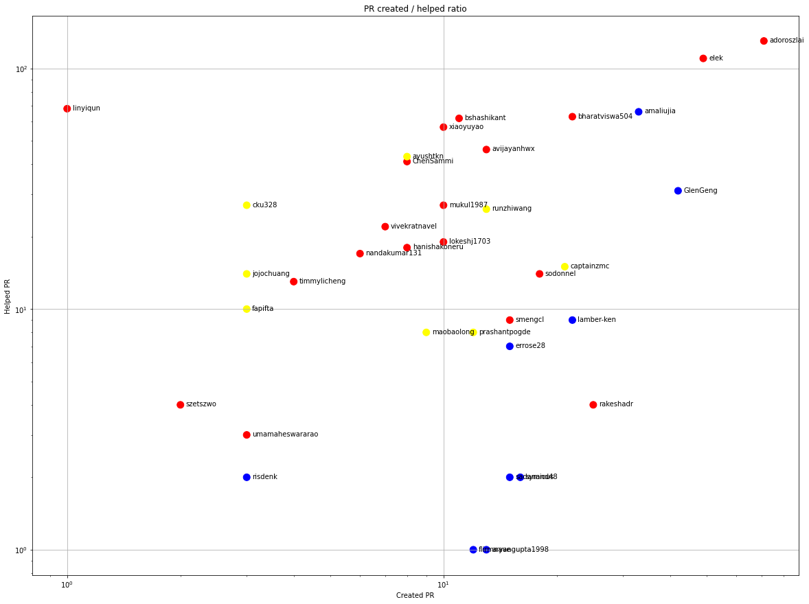
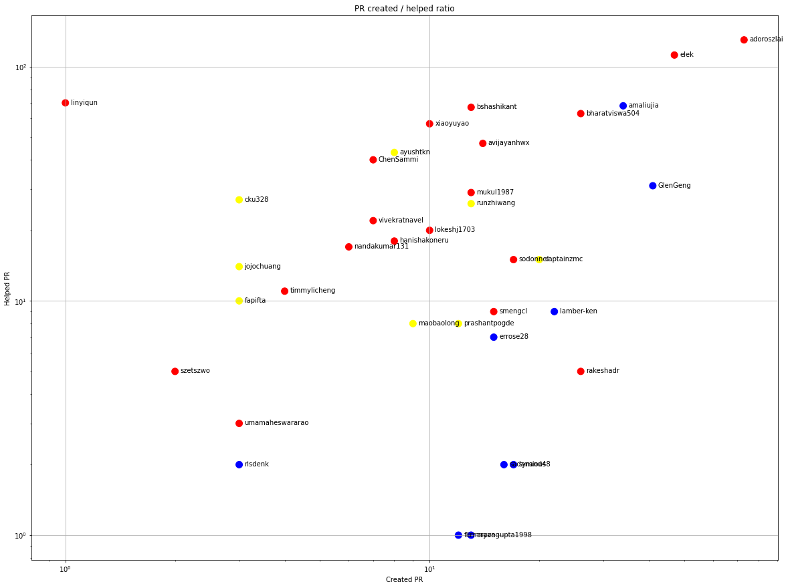
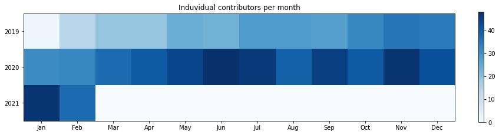
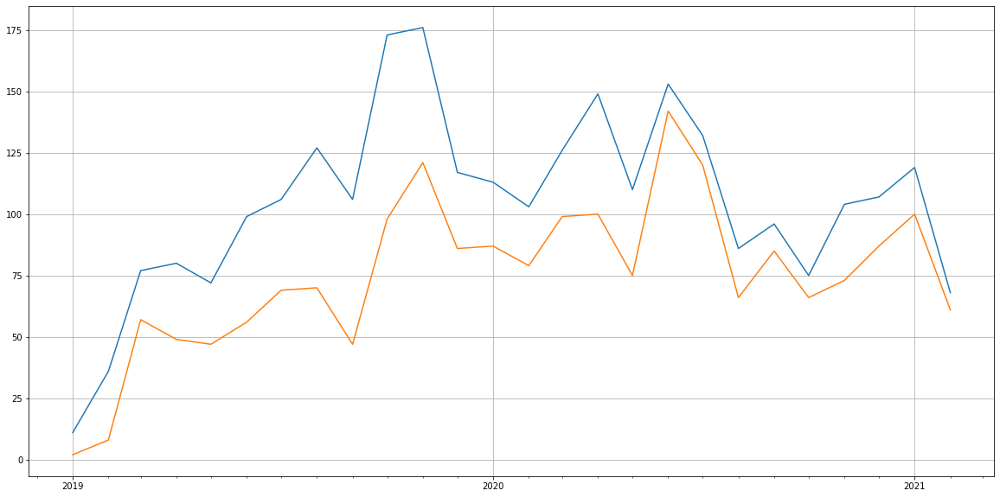

Latest record from the dataset:

<table border="1" class="dataframe">
  <thead>
    <tr style="text-align: right;">
      <th></th>
      <th>org</th>
      <th>repo</th>
      <th>type</th>
      <th>identifier</th>
      <th>subidentifier</th>
      <th>date</th>
      <th>author</th>
      <th>owner</th>
    </tr>
  </thead>
  <tbody>
    <tr>
      <th>7843</th>
      <td>apache</td>
      <td>ozone</td>
      <td>PR_COMMENTED</td>
      <td>1766</td>
      <td>NaN</td>
      <td>2021-02-11 04:27:15+00:00</td>
      <td>bharatviswa504</td>
      <td>bharatviswa504</td>
    </tr>
  </tbody>
</table>

# Github Contributions per user

<table border="1" class="dataframe">
  <thead>
    <tr style="text-align: right;">
      <th></th>
      <th>contributions</th>
    </tr>
    <tr>
      <th>author</th>
      <th></th>
    </tr>
  </thead>
  <tbody>
    <tr>
      <th>bharatviswa504</th>
      <td>1179</td>
    </tr>
    <tr>
      <th>adoroszlai</th>
      <td>1149</td>
    </tr>
    <tr>
      <th>xiaoyuyao</th>
      <td>1079</td>
    </tr>
    <tr>
      <th>elek</th>
      <td>932</td>
    </tr>
    <tr>
      <th>bshashikant</th>
      <td>354</td>
    </tr>
    <tr>
      <th>avijayanhwx</th>
      <td>337</td>
    </tr>
    <tr>
      <th>dineshchitlangia</th>
      <td>330</td>
    </tr>
    <tr>
      <th>arp7</th>
      <td>273</td>
    </tr>
    <tr>
      <th>anuengineer</th>
      <td>257</td>
    </tr>
    <tr>
      <th>linyiqun</th>
      <td>246</td>
    </tr>
  </tbody>
</table>

## Contributors per participations in PRs which are not created by self (helping PRs)

<table border="1" class="dataframe">
  <thead>
    <tr style="text-align: right;">
      <th></th>
      <th>identifier</th>
    </tr>
    <tr>
      <th>author</th>
      <th></th>
    </tr>
  </thead>
  <tbody>
    <tr>
      <th>adoroszlai</th>
      <td>509</td>
    </tr>
    <tr>
      <th>elek</th>
      <td>413</td>
    </tr>
    <tr>
      <th>bharatviswa504</th>
      <td>295</td>
    </tr>
    <tr>
      <th>xiaoyuyao</th>
      <td>292</td>
    </tr>
    <tr>
      <th>dineshchitlangia</th>
      <td>146</td>
    </tr>
    <tr>
      <th>avijayanhwx</th>
      <td>143</td>
    </tr>
    <tr>
      <th>bshashikant</th>
      <td>140</td>
    </tr>
    <tr>
      <th>arp7</th>
      <td>126</td>
    </tr>
    <tr>
      <th>anuengineer</th>
      <td>121</td>
    </tr>
    <tr>
      <th>vivekratnavel</th>
      <td>100</td>
    </tr>
    <tr>
      <th>mukul1987</th>
      <td>97</td>
    </tr>
    <tr>
      <th>ChenSammi</th>
      <td>92</td>
    </tr>
    <tr>
      <th>github-actions</th>
      <td>85</td>
    </tr>
    <tr>
      <th>codecov-commenter</th>
      <td>76</td>
    </tr>
    <tr>
      <th>nandakumar131</th>
      <td>76</td>
    </tr>
    <tr>
      <th>linyiqun</th>
      <td>71</td>
    </tr>
    <tr>
      <th>amaliujia</th>
      <td>67</td>
    </tr>
    <tr>
      <th>hanishakoneru</th>
      <td>62</td>
    </tr>
    <tr>
      <th>lokeshj1703</th>
      <td>59</td>
    </tr>
    <tr>
      <th>swagle</th>
      <td>56</td>
    </tr>
  </tbody>
</table>

## Contributors per participations in any PRs

<table border="1" class="dataframe">
  <thead>
    <tr style="text-align: right;">
      <th></th>
      <th>identifier</th>
    </tr>
    <tr>
      <th>author</th>
      <th></th>
    </tr>
  </thead>
  <tbody>
    <tr>
      <th>adoroszlai</th>
      <td>782</td>
    </tr>
    <tr>
      <th>elek</th>
      <td>596</td>
    </tr>
    <tr>
      <th>bharatviswa504</th>
      <td>427</td>
    </tr>
    <tr>
      <th>xiaoyuyao</th>
      <td>329</td>
    </tr>
    <tr>
      <th>avijayanhwx</th>
      <td>220</td>
    </tr>
    <tr>
      <th>bshashikant</th>
      <td>190</td>
    </tr>
    <tr>
      <th>dineshchitlangia</th>
      <td>164</td>
    </tr>
    <tr>
      <th>vivekratnavel</th>
      <td>154</td>
    </tr>
    <tr>
      <th>mukul1987</th>
      <td>139</td>
    </tr>
    <tr>
      <th>ChenSammi</th>
      <td>128</td>
    </tr>
    <tr>
      <th>arp7</th>
      <td>128</td>
    </tr>
    <tr>
      <th>anuengineer</th>
      <td>123</td>
    </tr>
    <tr>
      <th>hanishakoneru</th>
      <td>110</td>
    </tr>
    <tr>
      <th>amaliujia</th>
      <td>102</td>
    </tr>
    <tr>
      <th>nandakumar131</th>
      <td>98</td>
    </tr>
    <tr>
      <th>maobaolong</th>
      <td>96</td>
    </tr>
    <tr>
      <th>swagle</th>
      <td>89</td>
    </tr>
    <tr>
      <th>smengcl</th>
      <td>86</td>
    </tr>
    <tr>
      <th>github-actions</th>
      <td>85</td>
    </tr>
    <tr>
      <th>GlenGeng</th>
      <td>84</td>
    </tr>
  </tbody>
</table>

# Bus factor (number of contributors responsible for the 50% of the prs) from last half year

## Contributors until the half of the all contributions

<table border="1" class="dataframe">
  <thead>
    <tr style="text-align: right;">
      <th></th>
      <th>author</th>
      <th>identifier</th>
      <th>cs</th>
      <th>ratio</th>
    </tr>
  </thead>
  <tbody>
    <tr>
      <th>0</th>
      <td>adoroszlai</td>
      <td>71</td>
      <td>71</td>
      <td>12.095400</td>
    </tr>
    <tr>
      <th>1</th>
      <td>elek</td>
      <td>49</td>
      <td>120</td>
      <td>8.347530</td>
    </tr>
    <tr>
      <th>2</th>
      <td>GlenGeng</td>
      <td>42</td>
      <td>162</td>
      <td>7.155026</td>
    </tr>
    <tr>
      <th>3</th>
      <td>amaliujia</td>
      <td>33</td>
      <td>195</td>
      <td>5.621806</td>
    </tr>
    <tr>
      <th>4</th>
      <td>rakeshadr</td>
      <td>25</td>
      <td>220</td>
      <td>4.258944</td>
    </tr>
    <tr>
      <th>5</th>
      <td>lamber-ken</td>
      <td>22</td>
      <td>242</td>
      <td>3.747871</td>
    </tr>
    <tr>
      <th>6</th>
      <td>bharatviswa504</td>
      <td>22</td>
      <td>264</td>
      <td>3.747871</td>
    </tr>
    <tr>
      <th>7</th>
      <td>captainzmc</td>
      <td>21</td>
      <td>285</td>
      <td>3.577513</td>
    </tr>
  </tbody>
</table>

## Pony number (bus factor)

    9

## Dev power (All the contributions in the ration of the top contributor)

    8.26760563380282

    

    

## People with created PRs > reviewed/commented PRS

    

    

## Same graph with focusing to the last 6 month

Only contributors with both created pr and helped pr visible

    

    

# Number of individual contributors per month

Number of different Github users who either created PR, commented PR, added review to a PR

Note: only events from apache/hadoop-ozone repository are included. Earlier PRs/comments are not here.

    

    

# Number of PRs closed/created per month

    /usr/lib/python3.9/site-packages/pandas/core/arrays/datetimes.py:1101: UserWarning: Converting to PeriodArray/Index representation will drop timezone information.
      warnings.warn(

    

    

# PR activity heatmap

    

    

