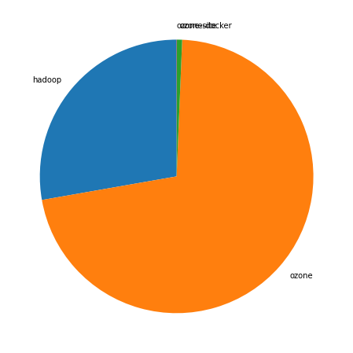
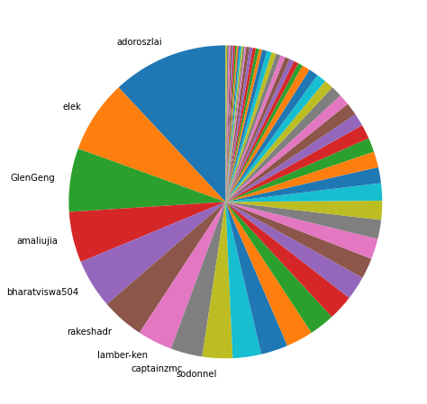
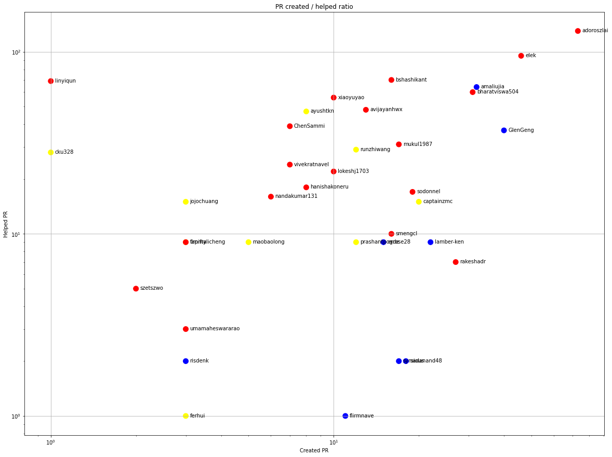
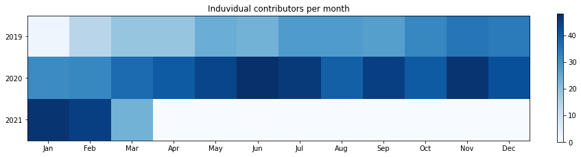
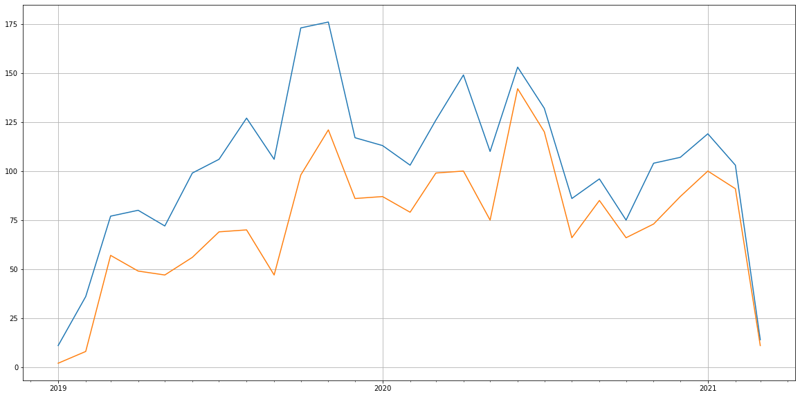
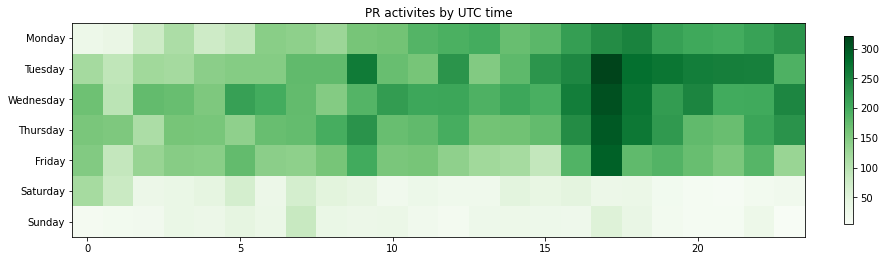
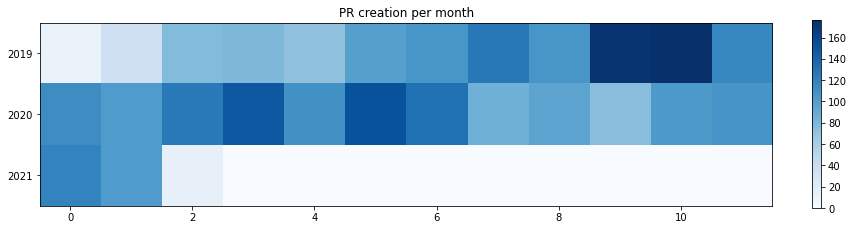

Latest record from the dataset:

<table border="1" class="dataframe">
  <thead>
    <tr style="text-align: right;">
      <th></th>
      <th>org</th>
      <th>repo</th>
      <th>type</th>
      <th>identifier</th>
      <th>subidentifier</th>
      <th>date</th>
      <th>author</th>
      <th>owner</th>
    </tr>
  </thead>
  <tbody>
    <tr>
      <th>18176</th>
      <td>apache</td>
      <td>ozone</td>
      <td>PR_REVIEW_APPROVED</td>
      <td>1928</td>
      <td>NaN</td>
      <td>2021-03-02 15:22:03+00:00</td>
      <td>avijayanhwx</td>
      <td>adoroszlai</td>
    </tr>
  </tbody>
</table>

<table border="1" class="dataframe">
  <thead>
    <tr style="text-align: right;">
      <th></th>
      <th>org</th>
      <th>repo</th>
      <th>type</th>
      <th>identifier</th>
      <th>subidentifier</th>
      <th>date</th>
      <th>author</th>
      <th>owner</th>
    </tr>
  </thead>
  <tbody>
    <tr>
      <th>18509</th>
      <td>apache</td>
      <td>ozone</td>
      <td>PR_REVIEW_COMMENTED</td>
      <td>1969</td>
      <td>NaN</td>
      <td>2021-03-02 08:39:33+00:00</td>
      <td>bharatviswa504</td>
      <td>bharatviswa504</td>
    </tr>
    <tr>
      <th>18508</th>
      <td>apache</td>
      <td>ozone</td>
      <td>PR_REVIEW_COMMENTED</td>
      <td>1969</td>
      <td>NaN</td>
      <td>2021-03-02 08:38:08+00:00</td>
      <td>bharatviswa504</td>
      <td>bharatviswa504</td>
    </tr>
    <tr>
      <th>18540</th>
      <td>apache</td>
      <td>ozone</td>
      <td>PR_CREATED</td>
      <td>1978</td>
      <td>NaN</td>
      <td>2021-03-02 06:49:50+00:00</td>
      <td>bharatviswa504</td>
      <td>bharatviswa504</td>
    </tr>
    <tr>
      <th>18519</th>
      <td>apache</td>
      <td>ozone</td>
      <td>PR_CREATED</td>
      <td>1971</td>
      <td>NaN</td>
      <td>2021-03-01 07:01:35+00:00</td>
      <td>bharatviswa504</td>
      <td>bharatviswa504</td>
    </tr>
    <tr>
      <th>18498</th>
      <td>apache</td>
      <td>ozone</td>
      <td>PR_COMMENTED</td>
      <td>1969</td>
      <td>NaN</td>
      <td>2021-03-01 05:59:38+00:00</td>
      <td>bharatviswa504</td>
      <td>bharatviswa504</td>
    </tr>
    <tr>
      <th>18506</th>
      <td>apache</td>
      <td>ozone</td>
      <td>PR_REVIEW_COMMENTED</td>
      <td>1969</td>
      <td>NaN</td>
      <td>2021-03-01 05:58:11+00:00</td>
      <td>bharatviswa504</td>
      <td>bharatviswa504</td>
    </tr>
    <tr>
      <th>18505</th>
      <td>apache</td>
      <td>ozone</td>
      <td>PR_REVIEW_COMMENTED</td>
      <td>1969</td>
      <td>NaN</td>
      <td>2021-03-01 05:58:06+00:00</td>
      <td>bharatviswa504</td>
      <td>bharatviswa504</td>
    </tr>
    <tr>
      <th>18504</th>
      <td>apache</td>
      <td>ozone</td>
      <td>PR_REVIEW_COMMENTED</td>
      <td>1969</td>
      <td>NaN</td>
      <td>2021-03-01 05:58:00+00:00</td>
      <td>bharatviswa504</td>
      <td>bharatviswa504</td>
    </tr>
    <tr>
      <th>18385</th>
      <td>apache</td>
      <td>ozone</td>
      <td>PR_REVIEW_COMMENTED</td>
      <td>1953</td>
      <td>NaN</td>
      <td>2021-02-28 09:00:36+00:00</td>
      <td>bharatviswa504</td>
      <td>bshashikant</td>
    </tr>
    <tr>
      <th>18423</th>
      <td>apache</td>
      <td>ozone</td>
      <td>PR_COMMENTED</td>
      <td>1958</td>
      <td>NaN</td>
      <td>2021-02-26 16:54:45+00:00</td>
      <td>bharatviswa504</td>
      <td>bharatviswa504</td>
    </tr>
  </tbody>
</table>

## Created pull requests per repositories

<table border="1" class="dataframe">
  <thead>
    <tr style="text-align: right;">
      <th></th>
      <th>org</th>
      <th>repo</th>
      <th>no</th>
      <th>ratio</th>
    </tr>
  </thead>
  <tbody>
    <tr>
      <th>0</th>
      <td>apache</td>
      <td>hadoop</td>
      <td>769</td>
      <td>0.277617</td>
    </tr>
    <tr>
      <th>1</th>
      <td>apache</td>
      <td>ozone</td>
      <td>1983</td>
      <td>0.715884</td>
    </tr>
    <tr>
      <th>2</th>
      <td>apache</td>
      <td>ozone-docker</td>
      <td>17</td>
      <td>0.006137</td>
    </tr>
    <tr>
      <th>3</th>
      <td>apache</td>
      <td>ozone-site</td>
      <td>1</td>
      <td>0.000361</td>
    </tr>
  </tbody>
</table>

    

    

# Github Contributions per user

<table border="1" class="dataframe">
  <thead>
    <tr style="text-align: right;">
      <th></th>
      <th>contributions</th>
    </tr>
    <tr>
      <th>author</th>
      <th></th>
    </tr>
  </thead>
  <tbody>
    <tr>
      <th>bharatviswa504</th>
      <td>1868</td>
    </tr>
    <tr>
      <th>xiaoyuyao</th>
      <td>1493</td>
    </tr>
    <tr>
      <th>adoroszlai</th>
      <td>1265</td>
    </tr>
    <tr>
      <th>elek</th>
      <td>1183</td>
    </tr>
    <tr>
      <th>arp7</th>
      <td>689</td>
    </tr>
    <tr>
      <th>anuengineer</th>
      <td>605</td>
    </tr>
    <tr>
      <th>bshashikant</th>
      <td>472</td>
    </tr>
    <tr>
      <th>avijayanhwx</th>
      <td>379</td>
    </tr>
    <tr>
      <th>dineshchitlangia</th>
      <td>363</td>
    </tr>
    <tr>
      <th>nandakumar131</th>
      <td>318</td>
    </tr>
  </tbody>
</table>

## Contributors per participations in PRs which are not created by self (helping PRs)

<table border="1" class="dataframe">
  <thead>
    <tr style="text-align: right;">
      <th></th>
      <th>identifier</th>
    </tr>
    <tr>
      <th>author</th>
      <th></th>
    </tr>
  </thead>
  <tbody>
    <tr>
      <th>adoroszlai</th>
      <td>560</td>
    </tr>
    <tr>
      <th>elek</th>
      <td>520</td>
    </tr>
    <tr>
      <th>bharatviswa504</th>
      <td>428</td>
    </tr>
    <tr>
      <th>xiaoyuyao</th>
      <td>380</td>
    </tr>
    <tr>
      <th>anuengineer</th>
      <td>296</td>
    </tr>
    <tr>
      <th>arp7</th>
      <td>257</td>
    </tr>
    <tr>
      <th>bshashikant</th>
      <td>184</td>
    </tr>
    <tr>
      <th>avijayanhwx</th>
      <td>165</td>
    </tr>
    <tr>
      <th>dineshchitlangia</th>
      <td>162</td>
    </tr>
    <tr>
      <th>mukul1987</th>
      <td>153</td>
    </tr>
    <tr>
      <th>nandakumar131</th>
      <td>128</td>
    </tr>
    <tr>
      <th>vivekratnavel</th>
      <td>117</td>
    </tr>
    <tr>
      <th>ChenSammi</th>
      <td>100</td>
    </tr>
    <tr>
      <th>github-actions</th>
      <td>89</td>
    </tr>
    <tr>
      <th>hanishakoneru</th>
      <td>87</td>
    </tr>
    <tr>
      <th>swagle</th>
      <td>84</td>
    </tr>
    <tr>
      <th>lokeshj1703</th>
      <td>79</td>
    </tr>
    <tr>
      <th>linyiqun</th>
      <td>77</td>
    </tr>
    <tr>
      <th>codecov-commenter</th>
      <td>76</td>
    </tr>
    <tr>
      <th>amaliujia</th>
      <td>69</td>
    </tr>
  </tbody>
</table>

## Contributors per participations in any PRs

<table border="1" class="dataframe">
  <thead>
    <tr style="text-align: right;">
      <th></th>
      <th>identifier</th>
    </tr>
    <tr>
      <th>author</th>
      <th></th>
    </tr>
  </thead>
  <tbody>
    <tr>
      <th>adoroszlai</th>
      <td>886</td>
    </tr>
    <tr>
      <th>elek</th>
      <td>784</td>
    </tr>
    <tr>
      <th>bharatviswa504</th>
      <td>650</td>
    </tr>
    <tr>
      <th>xiaoyuyao</th>
      <td>450</td>
    </tr>
    <tr>
      <th>anuengineer</th>
      <td>304</td>
    </tr>
    <tr>
      <th>avijayanhwx</th>
      <td>276</td>
    </tr>
    <tr>
      <th>arp7</th>
      <td>268</td>
    </tr>
    <tr>
      <th>bshashikant</th>
      <td>266</td>
    </tr>
    <tr>
      <th>mukul1987</th>
      <td>216</td>
    </tr>
    <tr>
      <th>vivekratnavel</th>
      <td>200</td>
    </tr>
    <tr>
      <th>dineshchitlangia</th>
      <td>197</td>
    </tr>
    <tr>
      <th>nandakumar131</th>
      <td>185</td>
    </tr>
    <tr>
      <th>hanishakoneru</th>
      <td>153</td>
    </tr>
    <tr>
      <th>ChenSammi</th>
      <td>152</td>
    </tr>
    <tr>
      <th>swagle</th>
      <td>130</td>
    </tr>
    <tr>
      <th>lokeshj1703</th>
      <td>115</td>
    </tr>
    <tr>
      <th>amaliujia</th>
      <td>105</td>
    </tr>
    <tr>
      <th>smengcl</th>
      <td>104</td>
    </tr>
    <tr>
      <th>maobaolong</th>
      <td>97</td>
    </tr>
    <tr>
      <th>GlenGeng</th>
      <td>95</td>
    </tr>
  </tbody>
</table>

# Bus factor (number of contributors responsible for the 50% of the prs) from last half year

## Contributors until the half of the all contributions (last 6 month)

<table border="1" class="dataframe">
  <thead>
    <tr style="text-align: right;">
      <th></th>
      <th>author</th>
      <th>identifier</th>
      <th>cs</th>
      <th>ratio</th>
    </tr>
  </thead>
  <tbody>
    <tr>
      <th>0</th>
      <td>adoroszlai</td>
      <td>73</td>
      <td>73</td>
      <td>11.947627</td>
    </tr>
    <tr>
      <th>1</th>
      <td>elek</td>
      <td>46</td>
      <td>119</td>
      <td>7.528642</td>
    </tr>
    <tr>
      <th>2</th>
      <td>GlenGeng</td>
      <td>40</td>
      <td>159</td>
      <td>6.546645</td>
    </tr>
    <tr>
      <th>3</th>
      <td>amaliujia</td>
      <td>32</td>
      <td>191</td>
      <td>5.237316</td>
    </tr>
    <tr>
      <th>4</th>
      <td>bharatviswa504</td>
      <td>31</td>
      <td>222</td>
      <td>5.073650</td>
    </tr>
    <tr>
      <th>5</th>
      <td>rakeshadr</td>
      <td>27</td>
      <td>249</td>
      <td>4.418985</td>
    </tr>
    <tr>
      <th>6</th>
      <td>lamber-ken</td>
      <td>22</td>
      <td>271</td>
      <td>3.600655</td>
    </tr>
    <tr>
      <th>7</th>
      <td>captainzmc</td>
      <td>20</td>
      <td>291</td>
      <td>3.273322</td>
    </tr>
  </tbody>
</table>

## Pony number (bus factor)

    9

## Dev power (All the contributions in the ration of the top contributor)

    8.369863013698629

    

    

## People with created PRs > reviewed/commented PRS

    

    

## Same graph with focusing to the last 6 month

Only contributors with both created pr and helped pr visible

    

    

# Number of individual contributors per month

Number of different Github users who either created PR, commented PR, added review to a PR

Note: only events from apache/hadoop-ozone repository are included. Earlier PRs/comments are not here.

<table border="1" class="dataframe">
  <thead>
    <tr style="text-align: right;">
      <th>month</th>
      <th>01</th>
      <th>02</th>
      <th>03</th>
      <th>04</th>
      <th>05</th>
      <th>06</th>
      <th>07</th>
      <th>08</th>
      <th>09</th>
      <th>10</th>
      <th>11</th>
      <th>12</th>
    </tr>
    <tr>
      <th>year</th>
      <th></th>
      <th></th>
      <th></th>
      <th></th>
      <th></th>
      <th></th>
      <th></th>
      <th></th>
      <th></th>
      <th></th>
      <th></th>
      <th></th>
    </tr>
  </thead>
  <tbody>
    <tr>
      <th>2019</th>
      <td>2.0</td>
      <td>14.0</td>
      <td>19.0</td>
      <td>19.0</td>
      <td>24.0</td>
      <td>23.0</td>
      <td>28.0</td>
      <td>28.0</td>
      <td>27.0</td>
      <td>32.0</td>
      <td>35.0</td>
      <td>34.0</td>
    </tr>
    <tr>
      <th>2020</th>
      <td>31.0</td>
      <td>32.0</td>
      <td>37.0</td>
      <td>40.0</td>
      <td>44.0</td>
      <td>48.0</td>
      <td>46.0</td>
      <td>39.0</td>
      <td>45.0</td>
      <td>40.0</td>
      <td>47.0</td>
      <td>42.0</td>
    </tr>
    <tr>
      <th>2021</th>
      <td>47.0</td>
      <td>45.0</td>
      <td>23.0</td>
      <td>0.0</td>
      <td>0.0</td>
      <td>0.0</td>
      <td>0.0</td>
      <td>0.0</td>
      <td>0.0</td>
      <td>0.0</td>
      <td>0.0</td>
      <td>0.0</td>
    </tr>
  </tbody>
</table>

    

    

# Number of PRs closed/created per month

    /usr/lib/python3.9/site-packages/pandas/core/arrays/datetimes.py:1101: UserWarning: Converting to PeriodArray/Index representation will drop timezone information.
      warnings.warn(

    

    

# PR activity heatmap

    

    

## Created PR per month

    

    

