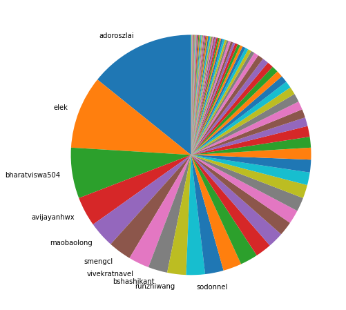
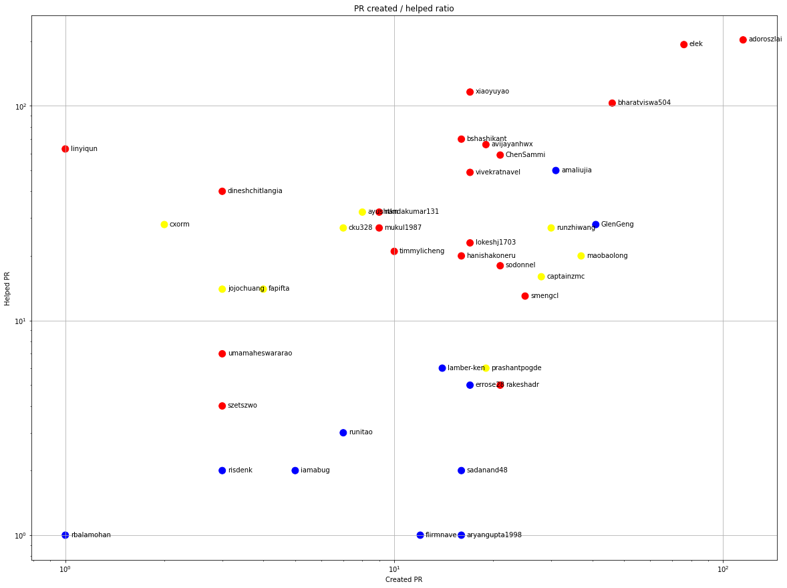
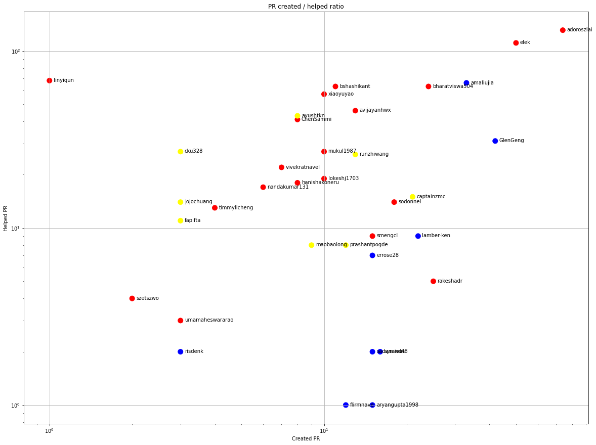
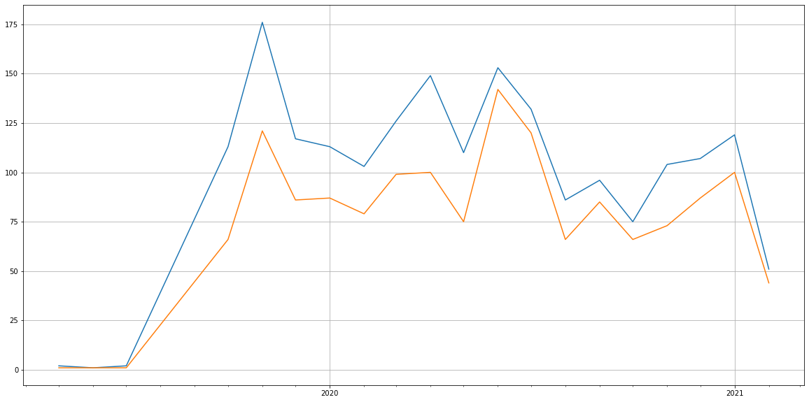

Latest record from the dataset:

    .dataframe tbody tr th:only-of-type {
        vertical-align: middle;
    }

    .dataframe tbody tr th {
        vertical-align: top;
    }

    .dataframe thead th {
        text-align: right;
    }
</style>
<table border="1" class="dataframe">
  <thead>
    <tr style="text-align: right;">
      <th></th>
      <th>org</th>
      <th>repo</th>
      <th>type</th>
      <th>identifier</th>
      <th>subidentifier</th>
      <th>date</th>
      <th>author</th>
      <th>owner</th>
    </tr>
  </thead>
  <tbody>
    <tr>
      <th>7843</th>
      <td>apache</td>
      <td>ozone</td>
      <td>PR_COMMENTED</td>
      <td>1766</td>
      <td>NaN</td>
      <td>2021-02-11 04:27:15+00:00</td>
      <td>bharatviswa504</td>
      <td>bharatviswa504</td>
    </tr>
  </tbody>
</table>

# Github Contributions per user

    .dataframe tbody tr th:only-of-type {
        vertical-align: middle;
    }

    .dataframe tbody tr th {
        vertical-align: top;
    }

    .dataframe thead th {
        text-align: right;
    }
</style>
<table border="1" class="dataframe">
  <thead>
    <tr style="text-align: right;">
      <th></th>
      <th>contributions</th>
    </tr>
    <tr>
      <th>author</th>
      <th></th>
    </tr>
  </thead>
  <tbody>
    <tr>
      <th>bharatviswa504</th>
      <td>1179</td>
    </tr>
    <tr>
      <th>adoroszlai</th>
      <td>1149</td>
    </tr>
    <tr>
      <th>xiaoyuyao</th>
      <td>1079</td>
    </tr>
    <tr>
      <th>elek</th>
      <td>932</td>
    </tr>
    <tr>
      <th>bshashikant</th>
      <td>354</td>
    </tr>
    <tr>
      <th>avijayanhwx</th>
      <td>337</td>
    </tr>
    <tr>
      <th>dineshchitlangia</th>
      <td>330</td>
    </tr>
    <tr>
      <th>arp7</th>
      <td>273</td>
    </tr>
    <tr>
      <th>anuengineer</th>
      <td>257</td>
    </tr>
    <tr>
      <th>linyiqun</th>
      <td>246</td>
    </tr>
  </tbody>
</table>

## Contributors per participations in PRs which are not created by self (helping PRs)

    .dataframe tbody tr th:only-of-type {
        vertical-align: middle;
    }

    .dataframe tbody tr th {
        vertical-align: top;
    }

    .dataframe thead th {
        text-align: right;
    }
</style>
<table border="1" class="dataframe">
  <thead>
    <tr style="text-align: right;">
      <th></th>
      <th>identifier</th>
    </tr>
    <tr>
      <th>author</th>
      <th></th>
    </tr>
  </thead>
  <tbody>
    <tr>
      <th>adoroszlai</th>
      <td>509</td>
    </tr>
    <tr>
      <th>elek</th>
      <td>413</td>
    </tr>
    <tr>
      <th>bharatviswa504</th>
      <td>295</td>
    </tr>
    <tr>
      <th>xiaoyuyao</th>
      <td>292</td>
    </tr>
    <tr>
      <th>dineshchitlangia</th>
      <td>146</td>
    </tr>
    <tr>
      <th>avijayanhwx</th>
      <td>143</td>
    </tr>
    <tr>
      <th>bshashikant</th>
      <td>140</td>
    </tr>
    <tr>
      <th>arp7</th>
      <td>126</td>
    </tr>
    <tr>
      <th>anuengineer</th>
      <td>121</td>
    </tr>
    <tr>
      <th>vivekratnavel</th>
      <td>100</td>
    </tr>
    <tr>
      <th>mukul1987</th>
      <td>97</td>
    </tr>
    <tr>
      <th>ChenSammi</th>
      <td>92</td>
    </tr>
    <tr>
      <th>github-actions</th>
      <td>85</td>
    </tr>
    <tr>
      <th>codecov-commenter</th>
      <td>76</td>
    </tr>
    <tr>
      <th>nandakumar131</th>
      <td>76</td>
    </tr>
    <tr>
      <th>linyiqun</th>
      <td>71</td>
    </tr>
    <tr>
      <th>amaliujia</th>
      <td>67</td>
    </tr>
    <tr>
      <th>hanishakoneru</th>
      <td>62</td>
    </tr>
    <tr>
      <th>lokeshj1703</th>
      <td>59</td>
    </tr>
    <tr>
      <th>swagle</th>
      <td>56</td>
    </tr>
  </tbody>
</table>

## Contributors per participations in any PRs

    .dataframe tbody tr th:only-of-type {
        vertical-align: middle;
    }

    .dataframe tbody tr th {
        vertical-align: top;
    }

    .dataframe thead th {
        text-align: right;
    }
</style>
<table border="1" class="dataframe">
  <thead>
    <tr style="text-align: right;">
      <th></th>
      <th>identifier</th>
    </tr>
    <tr>
      <th>author</th>
      <th></th>
    </tr>
  </thead>
  <tbody>
    <tr>
      <th>adoroszlai</th>
      <td>782</td>
    </tr>
    <tr>
      <th>elek</th>
      <td>596</td>
    </tr>
    <tr>
      <th>bharatviswa504</th>
      <td>427</td>
    </tr>
    <tr>
      <th>xiaoyuyao</th>
      <td>329</td>
    </tr>
    <tr>
      <th>avijayanhwx</th>
      <td>220</td>
    </tr>
    <tr>
      <th>bshashikant</th>
      <td>190</td>
    </tr>
    <tr>
      <th>dineshchitlangia</th>
      <td>164</td>
    </tr>
    <tr>
      <th>vivekratnavel</th>
      <td>154</td>
    </tr>
    <tr>
      <th>mukul1987</th>
      <td>139</td>
    </tr>
    <tr>
      <th>ChenSammi</th>
      <td>128</td>
    </tr>
    <tr>
      <th>arp7</th>
      <td>128</td>
    </tr>
    <tr>
      <th>anuengineer</th>
      <td>123</td>
    </tr>
    <tr>
      <th>hanishakoneru</th>
      <td>110</td>
    </tr>
    <tr>
      <th>amaliujia</th>
      <td>102</td>
    </tr>
    <tr>
      <th>nandakumar131</th>
      <td>98</td>
    </tr>
    <tr>
      <th>maobaolong</th>
      <td>96</td>
    </tr>
    <tr>
      <th>swagle</th>
      <td>89</td>
    </tr>
    <tr>
      <th>smengcl</th>
      <td>86</td>
    </tr>
    <tr>
      <th>github-actions</th>
      <td>85</td>
    </tr>
    <tr>
      <th>GlenGeng</th>
      <td>84</td>
    </tr>
  </tbody>
</table>

# Bus factor (number of contributors responsible for the 50% of the prs)

## Contributors until the half of the all contributions

    .dataframe tbody tr th:only-of-type {
        vertical-align: middle;
    }

    .dataframe tbody tr th {
        vertical-align: top;
    }

    .dataframe thead th {
        text-align: right;
    }
</style>
<table border="1" class="dataframe">
  <thead>
    <tr style="text-align: right;">
      <th></th>
      <th>author</th>
      <th>identifier</th>
      <th>cs</th>
      <th>ratio</th>
    </tr>
  </thead>
  <tbody>
    <tr>
      <th>0</th>
      <td>adoroszlai</td>
      <td>275</td>
      <td>275</td>
      <td>14.211886</td>
    </tr>
    <tr>
      <th>1</th>
      <td>elek</td>
      <td>190</td>
      <td>465</td>
      <td>9.819121</td>
    </tr>
    <tr>
      <th>2</th>
      <td>bharatviswa504</td>
      <td>132</td>
      <td>597</td>
      <td>6.821705</td>
    </tr>
    <tr>
      <th>3</th>
      <td>avijayanhwx</td>
      <td>77</td>
      <td>674</td>
      <td>3.979328</td>
    </tr>
    <tr>
      <th>4</th>
      <td>maobaolong</td>
      <td>68</td>
      <td>742</td>
      <td>3.514212</td>
    </tr>
    <tr>
      <th>5</th>
      <td>smengcl</td>
      <td>60</td>
      <td>802</td>
      <td>3.100775</td>
    </tr>
    <tr>
      <th>6</th>
      <td>vivekratnavel</td>
      <td>54</td>
      <td>856</td>
      <td>2.790698</td>
    </tr>
    <tr>
      <th>7</th>
      <td>bshashikant</td>
      <td>50</td>
      <td>906</td>
      <td>2.583979</td>
    </tr>
    <tr>
      <th>8</th>
      <td>runzhiwang</td>
      <td>49</td>
      <td>955</td>
      <td>2.532300</td>
    </tr>
  </tbody>
</table>

## Pony number (bus factor)

    10

## Dev power (All the contributions in the ration of the top contributor)

    7.036363636363638

    

    

## People with created PRs > reviewed/commented PRS

    

    

# Number of individual contributors per month

Number of different Github users who either created PR, commented PR, added review to a PR

Note: only events from apache/hadoop-ozone repository are included. Earlier PRs/comments are not here.

    /usr/lib/python3.9/site-packages/pandas/core/arrays/datetimes.py:1101: UserWarning: Converting to PeriodArray/Index representation will drop timezone information.
      warnings.warn(

    .dataframe tbody tr th:only-of-type {
        vertical-align: middle;
    }

    .dataframe tbody tr th {
        vertical-align: top;
    }

    .dataframe thead th {
        text-align: right;
    }
</style>
<table border="1" class="dataframe">
  <thead>
    <tr style="text-align: right;">
      <th></th>
      <th>date</th>
      <th>author</th>
    </tr>
  </thead>
  <tbody>
    <tr>
      <th>8</th>
      <td>2020-03</td>
      <td>37</td>
    </tr>
    <tr>
      <th>9</th>
      <td>2020-04</td>
      <td>40</td>
    </tr>
    <tr>
      <th>10</th>
      <td>2020-05</td>
      <td>44</td>
    </tr>
    <tr>
      <th>11</th>
      <td>2020-06</td>
      <td>48</td>
    </tr>
    <tr>
      <th>12</th>
      <td>2020-07</td>
      <td>46</td>
    </tr>
    <tr>
      <th>13</th>
      <td>2020-08</td>
      <td>39</td>
    </tr>
    <tr>
      <th>14</th>
      <td>2020-09</td>
      <td>45</td>
    </tr>
    <tr>
      <th>15</th>
      <td>2020-10</td>
      <td>40</td>
    </tr>
    <tr>
      <th>16</th>
      <td>2020-11</td>
      <td>47</td>
    </tr>
    <tr>
      <th>17</th>
      <td>2020-12</td>
      <td>42</td>
    </tr>
    <tr>
      <th>18</th>
      <td>2021-01</td>
      <td>47</td>
    </tr>
    <tr>
      <th>19</th>
      <td>2021-02</td>
      <td>35</td>
    </tr>
  </tbody>
</table>

    

    

# Number of PRs closed/created per month

    /usr/lib/python3.9/site-packages/pandas/core/arrays/datetimes.py:1101: UserWarning: Converting to PeriodArray/Index representation will drop timezone information.
      warnings.warn(

    

    

## Monthly comments

    /usr/lib/python3.9/site-packages/pandas/core/arrays/datetimes.py:1101: UserWarning: Converting to PeriodArray/Index representation will drop timezone information.
      warnings.warn(

    .dataframe tbody tr th:only-of-type {
        vertical-align: middle;
    }

    .dataframe tbody tr th {
        vertical-align: top;
    }

    .dataframe thead th {
        text-align: right;
    }
</style>
<table border="1" class="dataframe">
  <thead>
    <tr style="text-align: right;">
      <th></th>
      <th>identifier</th>
    </tr>
    <tr>
      <th>date</th>
      <th></th>
    </tr>
  </thead>
  <tbody>
    <tr>
      <th>2019-05</th>
      <td>4</td>
    </tr>
    <tr>
      <th>2019-06</th>
      <td>14</td>
    </tr>
    <tr>
      <th>2019-07</th>
      <td>1</td>
    </tr>
    <tr>
      <th>2019-10</th>
      <td>250</td>
    </tr>
    <tr>
      <th>2019-11</th>
      <td>383</td>
    </tr>
    <tr>
      <th>2019-12</th>
      <td>320</td>
    </tr>
    <tr>
      <th>2020-01</th>
      <td>281</td>
    </tr>
    <tr>
      <th>2020-02</th>
      <td>225</td>
    </tr>
    <tr>
      <th>2020-03</th>
      <td>403</td>
    </tr>
    <tr>
      <th>2020-04</th>
      <td>442</td>
    </tr>
    <tr>
      <th>2020-05</th>
      <td>400</td>
    </tr>
    <tr>
      <th>2020-06</th>
      <td>562</td>
    </tr>
    <tr>
      <th>2020-07</th>
      <td>411</td>
    </tr>
    <tr>
      <th>2020-08</th>
      <td>306</td>
    </tr>
    <tr>
      <th>2020-09</th>
      <td>330</td>
    </tr>
    <tr>
      <th>2020-10</th>
      <td>200</td>
    </tr>
    <tr>
      <th>2020-11</th>
      <td>298</td>
    </tr>
    <tr>
      <th>2020-12</th>
      <td>315</td>
    </tr>
    <tr>
      <th>2021-01</th>
      <td>355</td>
    </tr>
    <tr>
      <th>2021-02</th>
      <td>198</td>
    </tr>
  </tbody>
</table>

