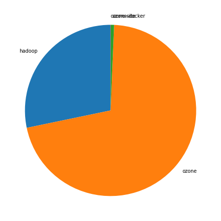
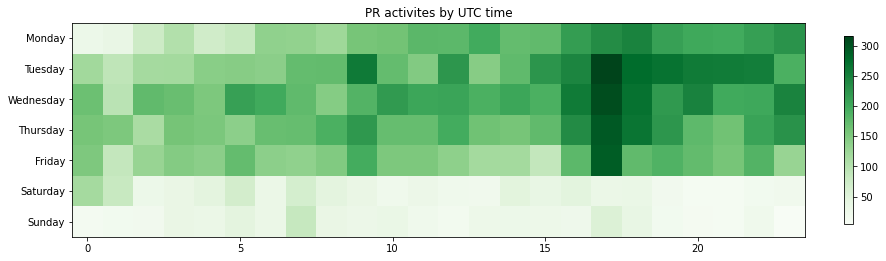
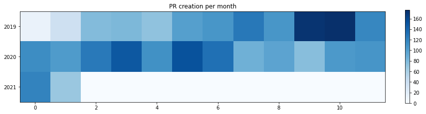

Latest record from the dataset:

<table border="1" class="dataframe">
  <thead>
    <tr style="text-align: right;">
      <th></th>
      <th>org</th>
      <th>repo</th>
      <th>type</th>
      <th>identifier</th>
      <th>subidentifier</th>
      <th>date</th>
      <th>author</th>
      <th>owner</th>
    </tr>
  </thead>
  <tbody>
    <tr>
      <th>17679</th>
      <td>apache</td>
      <td>ozone</td>
      <td>PR_MERGED</td>
      <td>1874</td>
      <td>NaN</td>
      <td>2021-02-18 18:58:33+00:00</td>
      <td>xiaoyuyao</td>
      <td>vivekratnavel</td>
    </tr>
  </tbody>
</table>

## Created pull requests per repositories

<table border="1" class="dataframe">
  <thead>
    <tr style="text-align: right;">
      <th></th>
      <th>org</th>
      <th>repo</th>
      <th>no</th>
      <th>ratio</th>
    </tr>
  </thead>
  <tbody>
    <tr>
      <th>0</th>
      <td>apache</td>
      <td>hadoop</td>
      <td>769</td>
      <td>0.282617</td>
    </tr>
    <tr>
      <th>1</th>
      <td>apache</td>
      <td>ozone</td>
      <td>1934</td>
      <td>0.710768</td>
    </tr>
    <tr>
      <th>2</th>
      <td>apache</td>
      <td>ozone-docker</td>
      <td>17</td>
      <td>0.006248</td>
    </tr>
    <tr>
      <th>3</th>
      <td>apache</td>
      <td>ozone-site</td>
      <td>1</td>
      <td>0.000368</td>
    </tr>
  </tbody>
</table>

    

    

# Github Contributions per user

<table border="1" class="dataframe">
  <thead>
    <tr style="text-align: right;">
      <th></th>
      <th>contributions</th>
    </tr>
    <tr>
      <th>author</th>
      <th></th>
    </tr>
  </thead>
  <tbody>
    <tr>
      <th>bharatviswa504</th>
      <td>1854</td>
    </tr>
    <tr>
      <th>xiaoyuyao</th>
      <td>1483</td>
    </tr>
    <tr>
      <th>adoroszlai</th>
      <td>1230</td>
    </tr>
    <tr>
      <th>elek</th>
      <td>1173</td>
    </tr>
    <tr>
      <th>arp7</th>
      <td>686</td>
    </tr>
    <tr>
      <th>anuengineer</th>
      <td>605</td>
    </tr>
    <tr>
      <th>bshashikant</th>
      <td>452</td>
    </tr>
    <tr>
      <th>avijayanhwx</th>
      <td>376</td>
    </tr>
    <tr>
      <th>dineshchitlangia</th>
      <td>363</td>
    </tr>
    <tr>
      <th>nandakumar131</th>
      <td>318</td>
    </tr>
  </tbody>
</table>

## Contributors per participations in PRs which are not created by self (helping PRs)

<table border="1" class="dataframe">
  <thead>
    <tr style="text-align: right;">
      <th></th>
      <th>identifier</th>
    </tr>
    <tr>
      <th>author</th>
      <th></th>
    </tr>
  </thead>
  <tbody>
    <tr>
      <th>adoroszlai</th>
      <td>544</td>
    </tr>
    <tr>
      <th>elek</th>
      <td>514</td>
    </tr>
    <tr>
      <th>bharatviswa504</th>
      <td>425</td>
    </tr>
    <tr>
      <th>xiaoyuyao</th>
      <td>378</td>
    </tr>
    <tr>
      <th>anuengineer</th>
      <td>296</td>
    </tr>
    <tr>
      <th>arp7</th>
      <td>257</td>
    </tr>
    <tr>
      <th>bshashikant</th>
      <td>177</td>
    </tr>
    <tr>
      <th>avijayanhwx</th>
      <td>163</td>
    </tr>
    <tr>
      <th>dineshchitlangia</th>
      <td>162</td>
    </tr>
    <tr>
      <th>mukul1987</th>
      <td>151</td>
    </tr>
    <tr>
      <th>nandakumar131</th>
      <td>128</td>
    </tr>
    <tr>
      <th>vivekratnavel</th>
      <td>115</td>
    </tr>
    <tr>
      <th>ChenSammi</th>
      <td>99</td>
    </tr>
    <tr>
      <th>hanishakoneru</th>
      <td>87</td>
    </tr>
    <tr>
      <th>github-actions</th>
      <td>85</td>
    </tr>
    <tr>
      <th>swagle</th>
      <td>80</td>
    </tr>
    <tr>
      <th>lokeshj1703</th>
      <td>77</td>
    </tr>
    <tr>
      <th>codecov-commenter</th>
      <td>76</td>
    </tr>
    <tr>
      <th>linyiqun</th>
      <td>75</td>
    </tr>
    <tr>
      <th>amaliujia</th>
      <td>69</td>
    </tr>
  </tbody>
</table>

## Contributors per participations in any PRs

<table border="1" class="dataframe">
  <thead>
    <tr style="text-align: right;">
      <th></th>
      <th>identifier</th>
    </tr>
    <tr>
      <th>author</th>
      <th></th>
    </tr>
  </thead>
  <tbody>
    <tr>
      <th>adoroszlai</th>
      <td>863</td>
    </tr>
    <tr>
      <th>elek</th>
      <td>775</td>
    </tr>
    <tr>
      <th>bharatviswa504</th>
      <td>641</td>
    </tr>
    <tr>
      <th>xiaoyuyao</th>
      <td>448</td>
    </tr>
    <tr>
      <th>anuengineer</th>
      <td>304</td>
    </tr>
    <tr>
      <th>avijayanhwx</th>
      <td>274</td>
    </tr>
    <tr>
      <th>arp7</th>
      <td>268</td>
    </tr>
    <tr>
      <th>bshashikant</th>
      <td>256</td>
    </tr>
    <tr>
      <th>mukul1987</th>
      <td>210</td>
    </tr>
    <tr>
      <th>vivekratnavel</th>
      <td>198</td>
    </tr>
    <tr>
      <th>dineshchitlangia</th>
      <td>197</td>
    </tr>
    <tr>
      <th>nandakumar131</th>
      <td>185</td>
    </tr>
    <tr>
      <th>hanishakoneru</th>
      <td>153</td>
    </tr>
    <tr>
      <th>ChenSammi</th>
      <td>150</td>
    </tr>
    <tr>
      <th>swagle</th>
      <td>126</td>
    </tr>
    <tr>
      <th>lokeshj1703</th>
      <td>113</td>
    </tr>
    <tr>
      <th>amaliujia</th>
      <td>105</td>
    </tr>
    <tr>
      <th>smengcl</th>
      <td>98</td>
    </tr>
    <tr>
      <th>maobaolong</th>
      <td>96</td>
    </tr>
    <tr>
      <th>sodonnel</th>
      <td>87</td>
    </tr>
  </tbody>
</table>

# Bus factor (number of contributors responsible for the 50% of the prs) from last half year

## Contributors until the half of the all contributions (last 6 month)

<table border="1" class="dataframe">
  <thead>
    <tr style="text-align: right;">
      <th></th>
      <th>author</th>
      <th>identifier</th>
      <th>cs</th>
      <th>ratio</th>
    </tr>
  </thead>
  <tbody>
    <tr>
      <th>0</th>
      <td>adoroszlai</td>
      <td>73</td>
      <td>73</td>
      <td>12.207358</td>
    </tr>
    <tr>
      <th>1</th>
      <td>elek</td>
      <td>47</td>
      <td>120</td>
      <td>7.859532</td>
    </tr>
    <tr>
      <th>2</th>
      <td>GlenGeng</td>
      <td>41</td>
      <td>161</td>
      <td>6.856187</td>
    </tr>
    <tr>
      <th>3</th>
      <td>amaliujia</td>
      <td>34</td>
      <td>195</td>
      <td>5.685619</td>
    </tr>
    <tr>
      <th>4</th>
      <td>bharatviswa504</td>
      <td>26</td>
      <td>221</td>
      <td>4.347826</td>
    </tr>
    <tr>
      <th>5</th>
      <td>rakeshadr</td>
      <td>26</td>
      <td>247</td>
      <td>4.347826</td>
    </tr>
    <tr>
      <th>6</th>
      <td>lamber-ken</td>
      <td>22</td>
      <td>269</td>
      <td>3.678930</td>
    </tr>
    <tr>
      <th>7</th>
      <td>captainzmc</td>
      <td>20</td>
      <td>289</td>
      <td>3.344482</td>
    </tr>
  </tbody>
</table>

## Pony number (bus factor)

    9

## Dev power (All the contributions in the ration of the top contributor)

    8.191780821917806

    

    

## People with created PRs > reviewed/commented PRS

    

    

## Same graph with focusing to the last 6 month

Only contributors with both created pr and helped pr visible

    

    

# Number of individual contributors per month

Number of different Github users who either created PR, commented PR, added review to a PR

Note: only events from apache/hadoop-ozone repository are included. Earlier PRs/comments are not here.

<table border="1" class="dataframe">
  <thead>
    <tr style="text-align: right;">
      <th>month</th>
      <th>01</th>
      <th>02</th>
      <th>03</th>
      <th>04</th>
      <th>05</th>
      <th>06</th>
      <th>07</th>
      <th>08</th>
      <th>09</th>
      <th>10</th>
      <th>11</th>
      <th>12</th>
    </tr>
    <tr>
      <th>year</th>
      <th></th>
      <th></th>
      <th></th>
      <th></th>
      <th></th>
      <th></th>
      <th></th>
      <th></th>
      <th></th>
      <th></th>
      <th></th>
      <th></th>
    </tr>
  </thead>
  <tbody>
    <tr>
      <th>2019</th>
      <td>2.0</td>
      <td>14.0</td>
      <td>19.0</td>
      <td>19.0</td>
      <td>24.0</td>
      <td>23.0</td>
      <td>28.0</td>
      <td>28.0</td>
      <td>27.0</td>
      <td>32.0</td>
      <td>35.0</td>
      <td>34.0</td>
    </tr>
    <tr>
      <th>2020</th>
      <td>31.0</td>
      <td>32.0</td>
      <td>37.0</td>
      <td>40.0</td>
      <td>44.0</td>
      <td>48.0</td>
      <td>46.0</td>
      <td>39.0</td>
      <td>45.0</td>
      <td>40.0</td>
      <td>47.0</td>
      <td>42.0</td>
    </tr>
    <tr>
      <th>2021</th>
      <td>47.0</td>
      <td>37.0</td>
      <td>0.0</td>
      <td>0.0</td>
      <td>0.0</td>
      <td>0.0</td>
      <td>0.0</td>
      <td>0.0</td>
      <td>0.0</td>
      <td>0.0</td>
      <td>0.0</td>
      <td>0.0</td>
    </tr>
  </tbody>
</table>

    

    

# Number of PRs closed/created per month

    /usr/lib/python3.9/site-packages/pandas/core/arrays/datetimes.py:1101: UserWarning: Converting to PeriodArray/Index representation will drop timezone information.
      warnings.warn(

    

    

# PR activity heatmap

    

    

## Created PR per month

    

    

