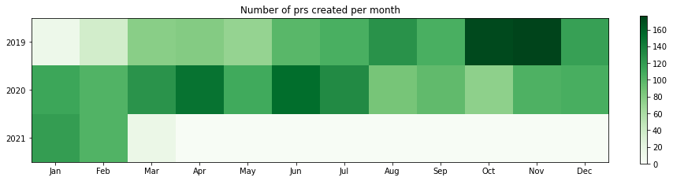
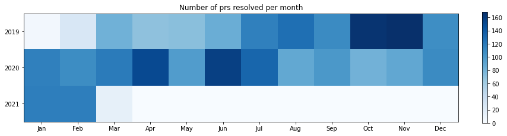
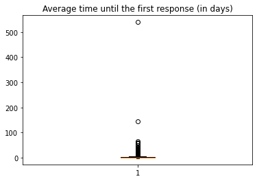
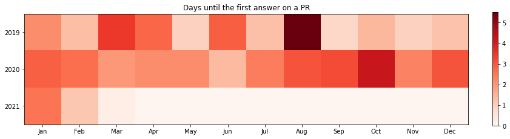
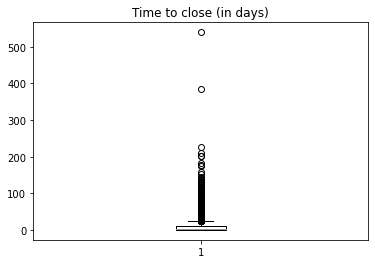
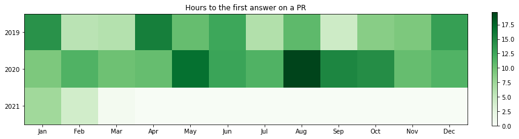

## Number of PRS per month

    

    

    

    

## Average time until the first response on a PR

    Timedelta('2 days 05:55:12.004942965')

    

    

    

    

## Top first responder users (excluding bots)

<table border="1" class="dataframe">
  <thead>
    <tr style="text-align: right;">
      <th></th>
      <th>number</th>
    </tr>
    <tr>
      <th>firstresponder</th>
      <th></th>
    </tr>
  </thead>
  <tbody>
    <tr>
      <th>adoroszlai</th>
      <td>402</td>
    </tr>
    <tr>
      <th>elek</th>
      <td>266</td>
    </tr>
    <tr>
      <th>bharatviswa504</th>
      <td>227</td>
    </tr>
    <tr>
      <th>xiaoyuyao</th>
      <td>204</td>
    </tr>
    <tr>
      <th>avijayanhwx</th>
      <td>133</td>
    </tr>
    <tr>
      <th>vivekratnavel</th>
      <td>107</td>
    </tr>
    <tr>
      <th>arp7</th>
      <td>101</td>
    </tr>
    <tr>
      <th>anuengineer</th>
      <td>93</td>
    </tr>
    <tr>
      <th>dineshchitlangia</th>
      <td>84</td>
    </tr>
    <tr>
      <th>mukul1987</th>
      <td>83</td>
    </tr>
  </tbody>
</table>

## Users who had to wait the most for the first answer

<table border="1" class="dataframe">
  <thead>
    <tr style="text-align: right;">
      <th></th>
      <th>timetofirstday</th>
    </tr>
    <tr>
      <th>author</th>
      <th></th>
    </tr>
  </thead>
  <tbody>
    <tr>
      <th>hgadre</th>
      <td>110.785396</td>
    </tr>
    <tr>
      <th>qizhu-lucas</th>
      <td>14.870486</td>
    </tr>
    <tr>
      <th>francis95-han</th>
      <td>6.995185</td>
    </tr>
    <tr>
      <th>frischHWC</th>
      <td>5.527434</td>
    </tr>
    <tr>
      <th>errose28</th>
      <td>5.013785</td>
    </tr>
    <tr>
      <th>masstter</th>
      <td>4.839346</td>
    </tr>
    <tr>
      <th>linyiqun</th>
      <td>4.708731</td>
    </tr>
    <tr>
      <th>iamabug</th>
      <td>4.500812</td>
    </tr>
    <tr>
      <th>yuyang733</th>
      <td>4.237263</td>
    </tr>
    <tr>
      <th>hanishakoneru</th>
      <td>4.060030</td>
    </tr>
  </tbody>
</table>

## Users who had to wait the less for the first answer

<table border="1" class="dataframe">
  <thead>
    <tr style="text-align: right;">
      <th></th>
      <th>timetofirstday</th>
    </tr>
    <tr>
      <th>author</th>
      <th></th>
    </tr>
  </thead>
  <tbody>
    <tr>
      <th>Tartarus0zm</th>
      <td>0.001418</td>
    </tr>
    <tr>
      <th>virajjasani</th>
      <td>0.002176</td>
    </tr>
    <tr>
      <th>insideo</th>
      <td>0.008061</td>
    </tr>
    <tr>
      <th>eyanghwx</th>
      <td>0.017546</td>
    </tr>
    <tr>
      <th>hemanthboyina</th>
      <td>0.026921</td>
    </tr>
    <tr>
      <th>john28152815</th>
      <td>0.041759</td>
    </tr>
    <tr>
      <th>jiwq</th>
      <td>0.045914</td>
    </tr>
    <tr>
      <th>harindersb</th>
      <td>0.050567</td>
    </tr>
    <tr>
      <th>zhengchenyu</th>
      <td>0.050718</td>
    </tr>
    <tr>
      <th>stackedsax</th>
      <td>0.051991</td>
    </tr>
  </tbody>
</table>

## Average time to close the PR

    

    

    

    

## Regular contributors by the average type of pull request lifetime (in days)

<table border="1" class="dataframe">
  <thead>
    <tr style="text-align: right;">
      <th></th>
      <th>mean</th>
      <th>count</th>
    </tr>
    <tr>
      <th>author</th>
      <th></th>
      <th></th>
    </tr>
  </thead>
  <tbody>
    <tr>
      <th>cxorm</th>
      <td>29.560776</td>
      <td>38</td>
    </tr>
    <tr>
      <th>maobaolong</th>
      <td>23.027269</td>
      <td>67</td>
    </tr>
    <tr>
      <th>lokeshj1703</th>
      <td>22.218305</td>
      <td>36</td>
    </tr>
    <tr>
      <th>amaliujia</th>
      <td>21.600151</td>
      <td>36</td>
    </tr>
    <tr>
      <th>iamabug</th>
      <td>19.071791</td>
      <td>46</td>
    </tr>
    <tr>
      <th>prashantpogde</th>
      <td>18.974934</td>
      <td>29</td>
    </tr>
    <tr>
      <th>sadanand48</th>
      <td>18.312549</td>
      <td>30</td>
    </tr>
    <tr>
      <th>captainzmc</th>
      <td>18.080332</td>
      <td>41</td>
    </tr>
    <tr>
      <th>hanishakoneru</th>
      <td>17.612548</td>
      <td>67</td>
    </tr>
    <tr>
      <th>smengcl</th>
      <td>16.471163</td>
      <td>74</td>
    </tr>
    <tr>
      <th>bshashikant</th>
      <td>14.486561</td>
      <td>81</td>
    </tr>
    <tr>
      <th>rakeshadr</th>
      <td>14.486224</td>
      <td>33</td>
    </tr>
    <tr>
      <th>timmylicheng</th>
      <td>13.229667</td>
      <td>41</td>
    </tr>
    <tr>
      <th>mukul1987</th>
      <td>12.978436</td>
      <td>64</td>
    </tr>
    <tr>
      <th>supratimdeka</th>
      <td>12.603652</td>
      <td>29</td>
    </tr>
    <tr>
      <th>ChenSammi</th>
      <td>12.196948</td>
      <td>53</td>
    </tr>
    <tr>
      <th>elek</th>
      <td>11.188411</td>
      <td>326</td>
    </tr>
    <tr>
      <th>ajayydv</th>
      <td>10.813479</td>
      <td>31</td>
    </tr>
    <tr>
      <th>runzhiwang</th>
      <td>9.944255</td>
      <td>47</td>
    </tr>
    <tr>
      <th>sodonnel</th>
      <td>8.433731</td>
      <td>60</td>
    </tr>
    <tr>
      <th>GlenGeng</th>
      <td>8.237647</td>
      <td>50</td>
    </tr>
    <tr>
      <th>bharatviswa504</th>
      <td>7.622397</td>
      <td>253</td>
    </tr>
    <tr>
      <th>swagle</th>
      <td>7.122095</td>
      <td>48</td>
    </tr>
    <tr>
      <th>nandakumar131</th>
      <td>6.706763</td>
      <td>59</td>
    </tr>
    <tr>
      <th>avijayanhwx</th>
      <td>6.656169</td>
      <td>120</td>
    </tr>
    <tr>
      <th>cku328</th>
      <td>6.161384</td>
      <td>22</td>
    </tr>
    <tr>
      <th>xiaoyuyao</th>
      <td>6.063487</td>
      <td>87</td>
    </tr>
    <tr>
      <th>dineshchitlangia</th>
      <td>5.562298</td>
      <td>35</td>
    </tr>
    <tr>
      <th>adoroszlai</th>
      <td>4.240346</td>
      <td>365</td>
    </tr>
    <tr>
      <th>vivekratnavel</th>
      <td>3.512246</td>
      <td>87</td>
    </tr>
  </tbody>
</table>

