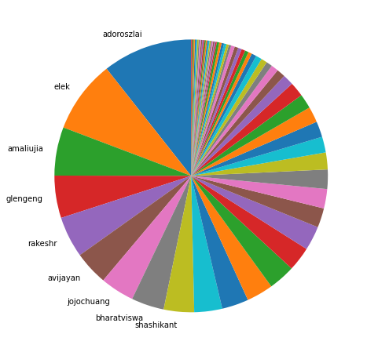
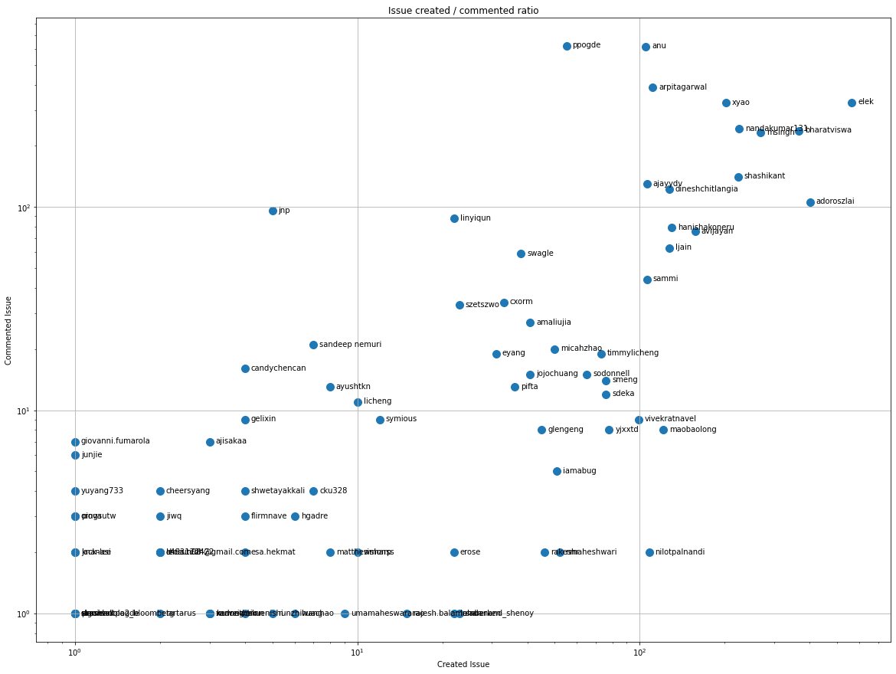
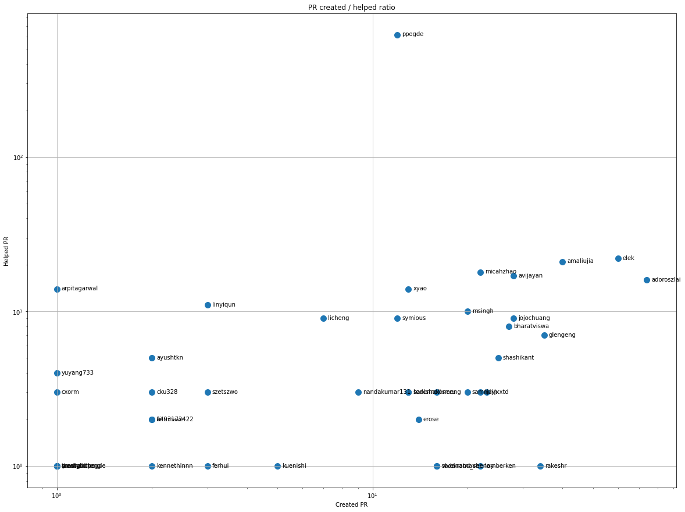
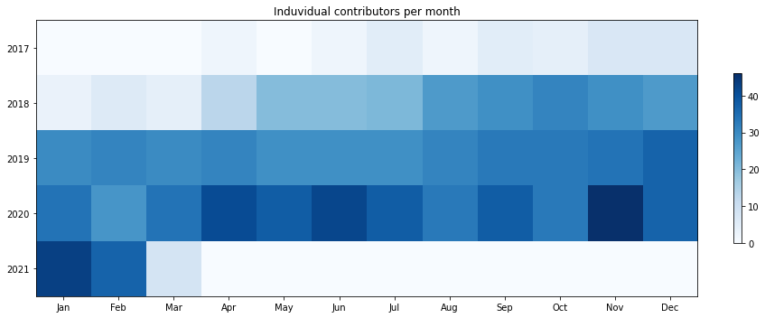
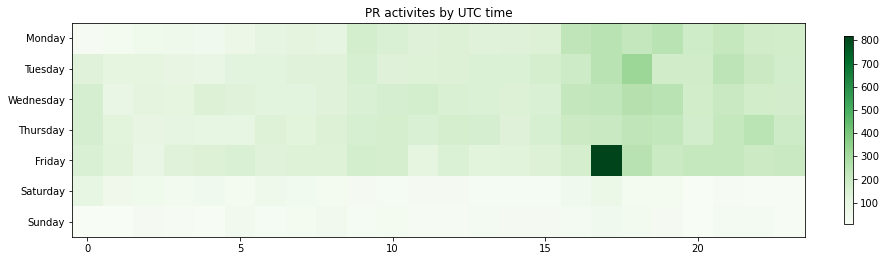

Latest record from the dataset:

<table border="1" class="dataframe">
  <thead>
    <tr style="text-align: right;">
      <th></th>
      <th>project</th>
      <th>type</th>
      <th>identifier</th>
      <th>subidentifier</th>
      <th>date</th>
      <th>author</th>
      <th>owner</th>
    </tr>
  </thead>
  <tbody>
    <tr>
      <th>15540</th>
      <td>HDDS</td>
      <td>JIRA_CREATED</td>
      <td>HDDS-4891</td>
      <td>NaN</td>
      <td>2021-03-02 12:33:41+00:00</td>
      <td>adoroszlai</td>
      <td>adoroszlai</td>
    </tr>
  </tbody>
</table>

# Github Contributions per user

<table border="1" class="dataframe">
  <thead>
    <tr style="text-align: right;">
      <th></th>
      <th>contributions</th>
    </tr>
    <tr>
      <th>author</th>
      <th></th>
    </tr>
  </thead>
  <tbody>
    <tr>
      <th>hadoopqa</th>
      <td>1853</td>
    </tr>
    <tr>
      <th>hudson</th>
      <td>1491</td>
    </tr>
    <tr>
      <th>anu</th>
      <td>1103</td>
    </tr>
    <tr>
      <th>genericqa</th>
      <td>864</td>
    </tr>
    <tr>
      <th>elek</th>
      <td>675</td>
    </tr>
    <tr>
      <th>ppogde</th>
      <td>627</td>
    </tr>
    <tr>
      <th>arpitagarwal</th>
      <td>603</td>
    </tr>
    <tr>
      <th>xyao</th>
      <td>541</td>
    </tr>
    <tr>
      <th>bharatviswa</th>
      <td>524</td>
    </tr>
    <tr>
      <th>nandakumar131</th>
      <td>426</td>
    </tr>
  </tbody>
</table>

## Contributors per participations in JIRA which are not created by self (commenting/helping JIRA)

<table border="1" class="dataframe">
  <thead>
    <tr style="text-align: right;">
      <th></th>
      <th>identifier</th>
    </tr>
    <tr>
      <th>author</th>
      <th></th>
    </tr>
  </thead>
  <tbody>
    <tr>
      <th>hudson</th>
      <td>1408</td>
    </tr>
    <tr>
      <th>hadoopqa</th>
      <td>684</td>
    </tr>
    <tr>
      <th>ppogde</th>
      <td>622</td>
    </tr>
    <tr>
      <th>anu</th>
      <td>616</td>
    </tr>
    <tr>
      <th>arpitagarwal</th>
      <td>388</td>
    </tr>
    <tr>
      <th>elek</th>
      <td>328</td>
    </tr>
    <tr>
      <th>xyao</th>
      <td>326</td>
    </tr>
    <tr>
      <th>genericqa</th>
      <td>259</td>
    </tr>
    <tr>
      <th>nandakumar131</th>
      <td>243</td>
    </tr>
    <tr>
      <th>bharatviswa</th>
      <td>237</td>
    </tr>
    <tr>
      <th>msingh</th>
      <td>232</td>
    </tr>
    <tr>
      <th>shashikant</th>
      <td>141</td>
    </tr>
    <tr>
      <th>ajayydv</th>
      <td>130</td>
    </tr>
    <tr>
      <th>dineshchitlangia</th>
      <td>122</td>
    </tr>
    <tr>
      <th>adoroszlai</th>
      <td>109</td>
    </tr>
    <tr>
      <th>jnp</th>
      <td>96</td>
    </tr>
    <tr>
      <th>linyiqun</th>
      <td>88</td>
    </tr>
    <tr>
      <th>hanishakoneru</th>
      <td>79</td>
    </tr>
    <tr>
      <th>avijayan</th>
      <td>76</td>
    </tr>
    <tr>
      <th>ljain</th>
      <td>63</td>
    </tr>
  </tbody>
</table>

## Contributors per participations in any issue

<table border="1" class="dataframe">
  <thead>
    <tr style="text-align: right;">
      <th></th>
      <th>identifier</th>
    </tr>
    <tr>
      <th>author</th>
      <th></th>
    </tr>
  </thead>
  <tbody>
    <tr>
      <th>hudson</th>
      <td>1408</td>
    </tr>
    <tr>
      <th>elek</th>
      <td>896</td>
    </tr>
    <tr>
      <th>anu</th>
      <td>721</td>
    </tr>
    <tr>
      <th>hadoopqa</th>
      <td>684</td>
    </tr>
    <tr>
      <th>ppogde</th>
      <td>678</td>
    </tr>
    <tr>
      <th>bharatviswa</th>
      <td>609</td>
    </tr>
    <tr>
      <th>xyao</th>
      <td>528</td>
    </tr>
    <tr>
      <th>adoroszlai</th>
      <td>519</td>
    </tr>
    <tr>
      <th>msingh</th>
      <td>503</td>
    </tr>
    <tr>
      <th>arpitagarwal</th>
      <td>499</td>
    </tr>
    <tr>
      <th>nandakumar131</th>
      <td>468</td>
    </tr>
    <tr>
      <th>shashikant</th>
      <td>369</td>
    </tr>
    <tr>
      <th>genericqa</th>
      <td>259</td>
    </tr>
    <tr>
      <th>dineshchitlangia</th>
      <td>249</td>
    </tr>
    <tr>
      <th>ajayydv</th>
      <td>236</td>
    </tr>
    <tr>
      <th>avijayan</th>
      <td>234</td>
    </tr>
    <tr>
      <th>hanishakoneru</th>
      <td>209</td>
    </tr>
    <tr>
      <th>ljain</th>
      <td>190</td>
    </tr>
    <tr>
      <th>sammi</th>
      <td>151</td>
    </tr>
    <tr>
      <th>maobaolong</th>
      <td>129</td>
    </tr>
  </tbody>
</table>

# Bus factor (number of contributors responsible for the 50% of the prs) from last half year

## Contributors until the half of the all contributions

<table border="1" class="dataframe">
  <thead>
    <tr style="text-align: right;">
      <th></th>
      <th>author</th>
      <th>identifier</th>
      <th>cs</th>
      <th>ratio</th>
    </tr>
  </thead>
  <tbody>
    <tr>
      <th>0</th>
      <td>adoroszlai</td>
      <td>74</td>
      <td>74</td>
      <td>10.616930</td>
    </tr>
    <tr>
      <th>1</th>
      <td>elek</td>
      <td>60</td>
      <td>134</td>
      <td>8.608321</td>
    </tr>
    <tr>
      <th>2</th>
      <td>amaliujia</td>
      <td>40</td>
      <td>174</td>
      <td>5.738881</td>
    </tr>
    <tr>
      <th>3</th>
      <td>glengeng</td>
      <td>35</td>
      <td>209</td>
      <td>5.021521</td>
    </tr>
    <tr>
      <th>4</th>
      <td>rakeshr</td>
      <td>34</td>
      <td>243</td>
      <td>4.878049</td>
    </tr>
    <tr>
      <th>5</th>
      <td>avijayan</td>
      <td>28</td>
      <td>271</td>
      <td>4.017217</td>
    </tr>
    <tr>
      <th>6</th>
      <td>jojochuang</td>
      <td>28</td>
      <td>299</td>
      <td>4.017217</td>
    </tr>
    <tr>
      <th>7</th>
      <td>bharatviswa</td>
      <td>27</td>
      <td>326</td>
      <td>3.873745</td>
    </tr>
  </tbody>
</table>

## Pony number (bus factor)

    9

## Dev power (All the contributions in the ration of the top contributor)

    9.41891891891892

    

    

## People with created JIRAs > commented JIRA

    

    

## Same graph with focusing to the last 6 month

Only contributors with both created pr and helped pr visible

    

    

# Number of individual contributors per month

Number of different Jira users who either created ssue or commented Issue

    

    

# JIRA activity heatmap

    

    

