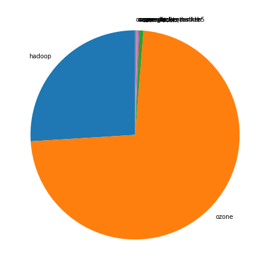
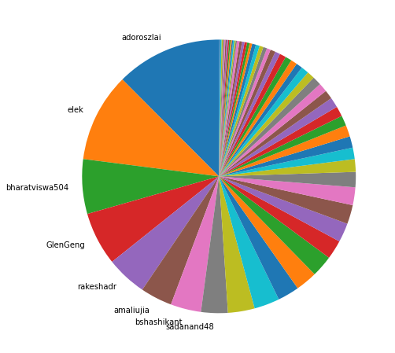
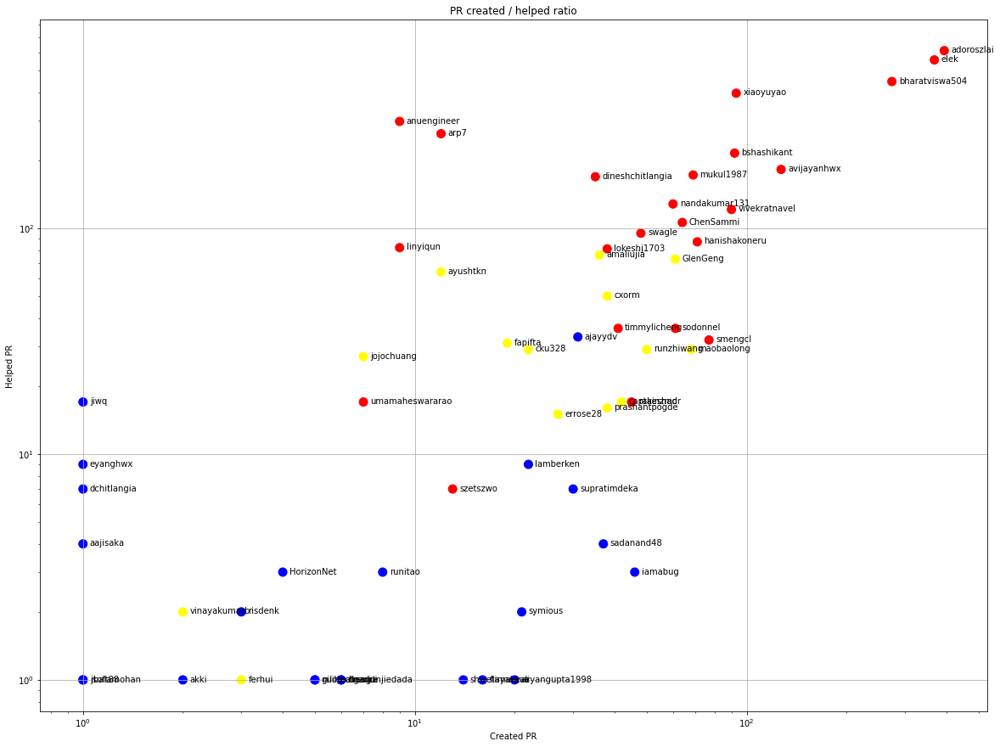
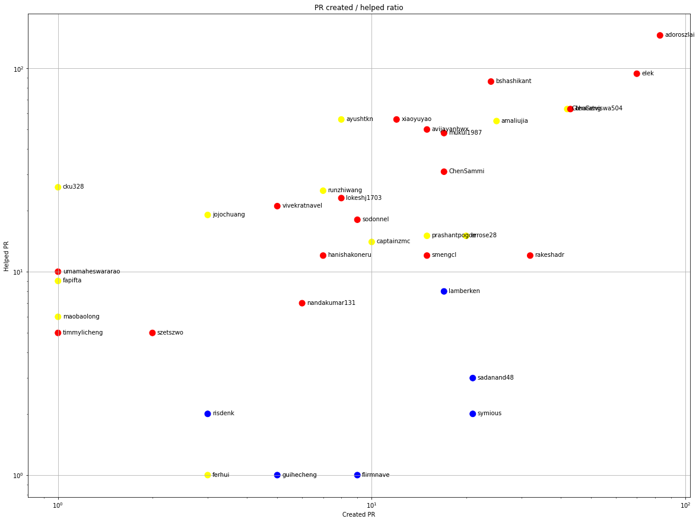
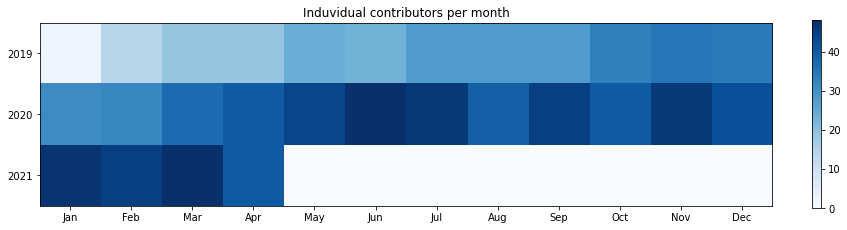
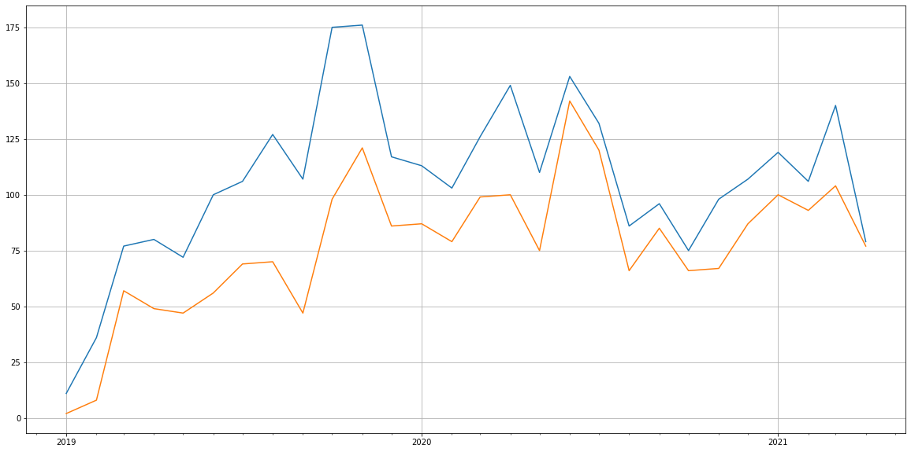
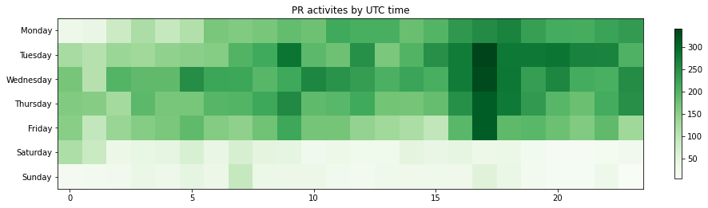
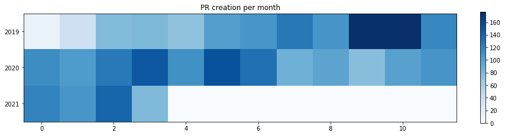

Latest record from the dataset:

<table border="1" class="dataframe">
  <thead>
    <tr style="text-align: right;">
      <th></th>
      <th>org</th>
      <th>repo</th>
      <th>identifier</th>
      <th>type</th>
      <th>subidentifier</th>
      <th>date</th>
      <th>author</th>
      <th>owner</th>
    </tr>
  </thead>
  <tbody>
    <tr>
      <th>27770</th>
      <td>apache</td>
      <td>ozone</td>
      <td>2168</td>
      <td>PR_COMMENTED</td>
      <td>824575283</td>
      <td>2021-04-22 06:26:51+00:00</td>
      <td>bharatviswa504</td>
      <td>adoroszlai</td>
    </tr>
  </tbody>
</table>

## Created pull requests per repositories

<table border="1" class="dataframe">
  <thead>
    <tr style="text-align: right;">
      <th></th>
      <th>org</th>
      <th>repo</th>
      <th>no</th>
      <th>ratio</th>
    </tr>
  </thead>
  <tbody>
    <tr>
      <th>0</th>
      <td>apache</td>
      <td>hadoop</td>
      <td>773</td>
      <td>0.259745</td>
    </tr>
    <tr>
      <th>1</th>
      <td>apache</td>
      <td>ozone</td>
      <td>2165</td>
      <td>0.727487</td>
    </tr>
    <tr>
      <th>2</th>
      <td>apache</td>
      <td>ozone-docker</td>
      <td>18</td>
      <td>0.006048</td>
    </tr>
    <tr>
      <th>3</th>
      <td>apache</td>
      <td>ozone-docker-builder</td>
      <td>2</td>
      <td>0.000672</td>
    </tr>
    <tr>
      <th>4</th>
      <td>apache</td>
      <td>ozone-docker-runner</td>
      <td>5</td>
      <td>0.001680</td>
    </tr>
    <tr>
      <th>5</th>
      <td>apache</td>
      <td>ozone-docker-testkrb5</td>
      <td>1</td>
      <td>0.000336</td>
    </tr>
    <tr>
      <th>6</th>
      <td>apache</td>
      <td>ozone-go</td>
      <td>6</td>
      <td>0.002016</td>
    </tr>
    <tr>
      <th>7</th>
      <td>apache</td>
      <td>ozone-site</td>
      <td>6</td>
      <td>0.002016</td>
    </tr>
  </tbody>
</table>

    <ipython-input-1-b478a6b49153>:3: MatplotlibDeprecationWarning: normalize=None does not normalize if the sum is less than 1 but this behavior is deprecated since 3.3 until two minor releases later. After the deprecation period the default value will be normalize=True. To prevent normalization pass normalize=False 
      plt.pie(per_repo["ratio"], labels=labels, startangle=90)

    

    

# Github Contributions per user

<table border="1" class="dataframe">
  <thead>
    <tr style="text-align: right;">
      <th></th>
      <th>contributions</th>
    </tr>
    <tr>
      <th>author</th>
      <th></th>
    </tr>
  </thead>
  <tbody>
    <tr>
      <th>bharatviswa504</th>
      <td>1917</td>
    </tr>
    <tr>
      <th>xiaoyuyao</th>
      <td>1577</td>
    </tr>
    <tr>
      <th>adoroszlai</th>
      <td>1370</td>
    </tr>
    <tr>
      <th>elek</th>
      <td>1283</td>
    </tr>
    <tr>
      <th>arp7</th>
      <td>705</td>
    </tr>
    <tr>
      <th>anuengineer</th>
      <td>608</td>
    </tr>
    <tr>
      <th>bshashikant</th>
      <td>560</td>
    </tr>
    <tr>
      <th>avijayanhwx</th>
      <td>423</td>
    </tr>
    <tr>
      <th>dineshchitlangia</th>
      <td>376</td>
    </tr>
    <tr>
      <th>mukul1987</th>
      <td>335</td>
    </tr>
  </tbody>
</table>

## Contributors per participations in PRs which are not created by self (helping PRs)

<table border="1" class="dataframe">
  <thead>
    <tr style="text-align: right;">
      <th></th>
      <th>identifier</th>
    </tr>
    <tr>
      <th>author</th>
      <th></th>
    </tr>
  </thead>
  <tbody>
    <tr>
      <th>adoroszlai</th>
      <td>611</td>
    </tr>
    <tr>
      <th>elek</th>
      <td>556</td>
    </tr>
    <tr>
      <th>bharatviswa504</th>
      <td>446</td>
    </tr>
    <tr>
      <th>xiaoyuyao</th>
      <td>396</td>
    </tr>
    <tr>
      <th>anuengineer</th>
      <td>297</td>
    </tr>
    <tr>
      <th>arp7</th>
      <td>262</td>
    </tr>
    <tr>
      <th>bshashikant</th>
      <td>215</td>
    </tr>
    <tr>
      <th>avijayanhwx</th>
      <td>182</td>
    </tr>
    <tr>
      <th>mukul1987</th>
      <td>172</td>
    </tr>
    <tr>
      <th>dineshchitlangia</th>
      <td>169</td>
    </tr>
    <tr>
      <th>nandakumar131</th>
      <td>128</td>
    </tr>
    <tr>
      <th>vivekratnavel</th>
      <td>121</td>
    </tr>
    <tr>
      <th>ChenSammi</th>
      <td>106</td>
    </tr>
    <tr>
      <th>swagle</th>
      <td>95</td>
    </tr>
    <tr>
      <th>github-actions</th>
      <td>90</td>
    </tr>
    <tr>
      <th>hanishakoneru</th>
      <td>87</td>
    </tr>
    <tr>
      <th>linyiqun</th>
      <td>82</td>
    </tr>
    <tr>
      <th>lokeshj1703</th>
      <td>81</td>
    </tr>
    <tr>
      <th>codecov-commenter</th>
      <td>76</td>
    </tr>
    <tr>
      <th>amaliujia</th>
      <td>76</td>
    </tr>
  </tbody>
</table>

## Contributors per participations in any PRs

<table border="1" class="dataframe">
  <thead>
    <tr style="text-align: right;">
      <th></th>
      <th>identifier</th>
    </tr>
    <tr>
      <th>author</th>
      <th></th>
    </tr>
  </thead>
  <tbody>
    <tr>
      <th>adoroszlai</th>
      <td>953</td>
    </tr>
    <tr>
      <th>elek</th>
      <td>845</td>
    </tr>
    <tr>
      <th>bharatviswa504</th>
      <td>687</td>
    </tr>
    <tr>
      <th>xiaoyuyao</th>
      <td>472</td>
    </tr>
    <tr>
      <th>bshashikant</th>
      <td>306</td>
    </tr>
    <tr>
      <th>anuengineer</th>
      <td>306</td>
    </tr>
    <tr>
      <th>avijayanhwx</th>
      <td>300</td>
    </tr>
    <tr>
      <th>arp7</th>
      <td>273</td>
    </tr>
    <tr>
      <th>mukul1987</th>
      <td>237</td>
    </tr>
    <tr>
      <th>vivekratnavel</th>
      <td>206</td>
    </tr>
    <tr>
      <th>dineshchitlangia</th>
      <td>204</td>
    </tr>
    <tr>
      <th>nandakumar131</th>
      <td>186</td>
    </tr>
    <tr>
      <th>ChenSammi</th>
      <td>168</td>
    </tr>
    <tr>
      <th>hanishakoneru</th>
      <td>155</td>
    </tr>
    <tr>
      <th>swagle</th>
      <td>141</td>
    </tr>
    <tr>
      <th>GlenGeng</th>
      <td>134</td>
    </tr>
    <tr>
      <th>lokeshj1703</th>
      <td>119</td>
    </tr>
    <tr>
      <th>amaliujia</th>
      <td>112</td>
    </tr>
    <tr>
      <th>smengcl</th>
      <td>109</td>
    </tr>
    <tr>
      <th>maobaolong</th>
      <td>97</td>
    </tr>
  </tbody>
</table>

# Bus factor (number of contributors responsible for the 50% of the prs) from last half year

## Contributors until the half of the all contributions (last 6 month)

<table border="1" class="dataframe">
  <thead>
    <tr style="text-align: right;">
      <th></th>
      <th>author</th>
      <th>identifier</th>
      <th>cs</th>
      <th>ratio</th>
    </tr>
  </thead>
  <tbody>
    <tr>
      <th>0</th>
      <td>adoroszlai</td>
      <td>83</td>
      <td>83</td>
      <td>12.462462</td>
    </tr>
    <tr>
      <th>1</th>
      <td>elek</td>
      <td>70</td>
      <td>153</td>
      <td>10.510511</td>
    </tr>
    <tr>
      <th>2</th>
      <td>bharatviswa504</td>
      <td>43</td>
      <td>196</td>
      <td>6.456456</td>
    </tr>
    <tr>
      <th>3</th>
      <td>GlenGeng</td>
      <td>42</td>
      <td>238</td>
      <td>6.306306</td>
    </tr>
    <tr>
      <th>4</th>
      <td>rakeshadr</td>
      <td>32</td>
      <td>270</td>
      <td>4.804805</td>
    </tr>
    <tr>
      <th>5</th>
      <td>amaliujia</td>
      <td>25</td>
      <td>295</td>
      <td>3.753754</td>
    </tr>
    <tr>
      <th>6</th>
      <td>bshashikant</td>
      <td>24</td>
      <td>319</td>
      <td>3.603604</td>
    </tr>
  </tbody>
</table>

## Pony number (bus factor)

    8

## Dev power (All the contributions in the ration of the top contributor)

    8.024096385542169

    

    

## People with created PRs > reviewed/commented PRS

    

    

## Same graph with focusing to the last 6 month

Only contributors with both created pr and helped pr visible

    

    

# Number of individual contributors per month

Number of different Github users who either created PR, commented PR, added review to a PR

Note: only events from apache/hadoop-ozone repository are included. Earlier PRs/comments are not here.

<table border="1" class="dataframe">
  <thead>
    <tr style="text-align: right;">
      <th>month</th>
      <th>01</th>
      <th>02</th>
      <th>03</th>
      <th>04</th>
      <th>05</th>
      <th>06</th>
      <th>07</th>
      <th>08</th>
      <th>09</th>
      <th>10</th>
      <th>11</th>
      <th>12</th>
    </tr>
    <tr>
      <th>year</th>
      <th></th>
      <th></th>
      <th></th>
      <th></th>
      <th></th>
      <th></th>
      <th></th>
      <th></th>
      <th></th>
      <th></th>
      <th></th>
      <th></th>
    </tr>
  </thead>
  <tbody>
    <tr>
      <th>2019</th>
      <td>2.0</td>
      <td>14.0</td>
      <td>19.0</td>
      <td>19.0</td>
      <td>24.0</td>
      <td>23.0</td>
      <td>28.0</td>
      <td>28.0</td>
      <td>28.0</td>
      <td>33.0</td>
      <td>35.0</td>
      <td>34.0</td>
    </tr>
    <tr>
      <th>2020</th>
      <td>31.0</td>
      <td>32.0</td>
      <td>37.0</td>
      <td>40.0</td>
      <td>44.0</td>
      <td>48.0</td>
      <td>46.0</td>
      <td>39.0</td>
      <td>45.0</td>
      <td>40.0</td>
      <td>46.0</td>
      <td>42.0</td>
    </tr>
    <tr>
      <th>2021</th>
      <td>47.0</td>
      <td>45.0</td>
      <td>48.0</td>
      <td>40.0</td>
      <td>0.0</td>
      <td>0.0</td>
      <td>0.0</td>
      <td>0.0</td>
      <td>0.0</td>
      <td>0.0</td>
      <td>0.0</td>
      <td>0.0</td>
    </tr>
  </tbody>
</table>

    

    

# Number of PRs closed/created per month

    /usr/lib/python3.9/site-packages/pandas/core/arrays/datetimes.py:1101: UserWarning: Converting to PeriodArray/Index representation will drop timezone information.
      warnings.warn(

    

    

# PR activity heatmap

    

    

## Created PR per month

    

    

