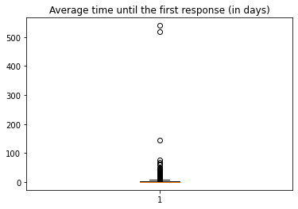
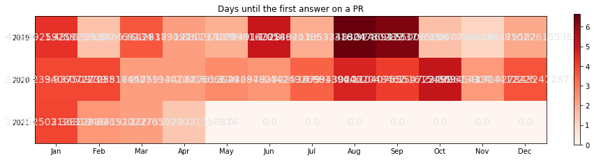

<table border="1" class="dataframe">
  <thead>
    <tr style="text-align: right;">
      <th></th>
      <th>prauthor</th>
      <th>createdat</th>
      <th>org</th>
      <th>repo</th>
      <th>identifier</th>
      <th>date</th>
      <th>author</th>
      <th>first_comment</th>
      <th>days</th>
    </tr>
  </thead>
  <tbody>
    <tr>
      <th>0</th>
      <td>hgadre</td>
      <td>2019-08-20 23:54:19+00:00</td>
      <td>apache</td>
      <td>hadoop</td>
      <td>1322</td>
      <td>2021-02-10T23:54:27Z</td>
      <td>aajisaka</td>
      <td>46656008</td>
      <td>540.000093</td>
    </tr>
    <tr>
      <th>1</th>
      <td>shwetayakkali</td>
      <td>2019-09-09 22:35:19+00:00</td>
      <td>apache</td>
      <td>hadoop</td>
      <td>1417</td>
      <td>2021-02-10T23:55:08Z</td>
      <td>aajisaka</td>
      <td>44932789</td>
      <td>520.055428</td>
    </tr>
    <tr>
      <th>2</th>
      <td>bharatviswa504</td>
      <td>2019-03-30 17:25:41+00:00</td>
      <td>apache</td>
      <td>hadoop</td>
      <td>670</td>
      <td>2019-08-21T20:20:52Z</td>
      <td>arp7</td>
      <td>12452111</td>
      <td>144.121655</td>
    </tr>
    <tr>
      <th>3</th>
      <td>sadanand48</td>
      <td>2021-01-25 06:47:54+00:00</td>
      <td>apache</td>
      <td>ozone</td>
      <td>1840</td>
      <td>2021-04-12T17:03:49Z</td>
      <td>mukul1987</td>
      <td>6689755</td>
      <td>77.427720</td>
    </tr>
    <tr>
      <th>4</th>
      <td>cxorm</td>
      <td>2020-08-07 09:20:30+00:00</td>
      <td>apache</td>
      <td>ozone</td>
      <td>1301</td>
      <td>2020-10-13T04:06:10Z</td>
      <td>xiaoyuyao</td>
      <td>5769940</td>
      <td>66.781713</td>
    </tr>
    <tr>
      <th>...</th>
      <td>...</td>
      <td>...</td>
      <td>...</td>
      <td>...</td>
      <td>...</td>
      <td>...</td>
      <td>...</td>
      <td>...</td>
      <td>...</td>
    </tr>
    <tr>
      <th>2786</th>
      <td>adoroszlai</td>
      <td>2019-10-16 04:51:38+00:00</td>
      <td>apache</td>
      <td>ozone</td>
      <td>34</td>
      <td>2019-10-16T04:52:28Z</td>
      <td>vivekratnavel</td>
      <td>50</td>
      <td>0.000579</td>
    </tr>
    <tr>
      <th>2787</th>
      <td>dineshchitlangia</td>
      <td>2019-10-04 20:36:28+00:00</td>
      <td>apache</td>
      <td>hadoop</td>
      <td>1602</td>
      <td>2019-10-04T20:37:14Z</td>
      <td>anuengineer</td>
      <td>46</td>
      <td>0.000532</td>
    </tr>
    <tr>
      <th>2788</th>
      <td>hanishakoneru</td>
      <td>2021-01-08 21:21:26+00:00</td>
      <td>apache</td>
      <td>ozone</td>
      <td>1768</td>
      <td>2021-01-08T21:21:55Z</td>
      <td>arp7</td>
      <td>29</td>
      <td>0.000336</td>
    </tr>
    <tr>
      <th>2789</th>
      <td>elek</td>
      <td>2021-04-09 16:56:50+00:00</td>
      <td>apache</td>
      <td>ozone-go</td>
      <td>4</td>
      <td>2021-04-09T16:57:15Z</td>
      <td>adoroszlai</td>
      <td>25</td>
      <td>0.000289</td>
    </tr>
    <tr>
      <th>2790</th>
      <td>vivekratnavel</td>
      <td>2019-11-21 06:13:26+00:00</td>
      <td>apache</td>
      <td>ozone</td>
      <td>245</td>
      <td>2019-11-21T06:13:50Z</td>
      <td>bharatviswa504</td>
      <td>24</td>
      <td>0.000278</td>
    </tr>
  </tbody>
</table>

2791 rows × 9 columns

## Average time until the first response on a PR

    3.0929437295141793

    

    

    

    

## Top first responder users (excluding bots)

<table border="1" class="dataframe">
  <thead>
    <tr style="text-align: right;">
      <th></th>
      <th>identifier</th>
    </tr>
    <tr>
      <th>author</th>
      <th></th>
    </tr>
  </thead>
  <tbody>
    <tr>
      <th>adoroszlai</th>
      <td>372</td>
    </tr>
    <tr>
      <th>elek</th>
      <td>312</td>
    </tr>
    <tr>
      <th>bharatviswa504</th>
      <td>279</td>
    </tr>
    <tr>
      <th>xiaoyuyao</th>
      <td>269</td>
    </tr>
    <tr>
      <th>anuengineer</th>
      <td>152</td>
    </tr>
    <tr>
      <th>arp7</th>
      <td>130</td>
    </tr>
    <tr>
      <th>avijayanhwx</th>
      <td>125</td>
    </tr>
    <tr>
      <th>bshashikant</th>
      <td>123</td>
    </tr>
    <tr>
      <th>mukul1987</th>
      <td>113</td>
    </tr>
    <tr>
      <th>dineshchitlangia</th>
      <td>93</td>
    </tr>
  </tbody>
</table>

## Users who had to wait the most for the first answer

<table border="1" class="dataframe">
  <thead>
    <tr style="text-align: right;">
      <th></th>
      <th>days</th>
    </tr>
    <tr>
      <th>prauthor</th>
      <th></th>
    </tr>
  </thead>
  <tbody>
    <tr>
      <th>hgadre</th>
      <td>110.785396</td>
    </tr>
    <tr>
      <th>shwetayakkali</th>
      <td>40.583849</td>
    </tr>
    <tr>
      <th>jsoft88</th>
      <td>23.966667</td>
    </tr>
    <tr>
      <th>qizhu-lucas</th>
      <td>14.870486</td>
    </tr>
    <tr>
      <th>eyanghwx</th>
      <td>12.530266</td>
    </tr>
    <tr>
      <th>mookkiah</th>
      <td>12.034410</td>
    </tr>
    <tr>
      <th>cxorm</th>
      <td>6.889217</td>
    </tr>
    <tr>
      <th>iamabug</th>
      <td>6.515687</td>
    </tr>
    <tr>
      <th>symious</th>
      <td>6.469619</td>
    </tr>
    <tr>
      <th>errose28</th>
      <td>6.027018</td>
    </tr>
    <tr>
      <th>frischHWC</th>
      <td>5.527434</td>
    </tr>
    <tr>
      <th>aryangupta1998</th>
      <td>5.223003</td>
    </tr>
    <tr>
      <th>masstter</th>
      <td>4.839346</td>
    </tr>
    <tr>
      <th>amaliujia</th>
      <td>4.805593</td>
    </tr>
    <tr>
      <th>linyiqun</th>
      <td>4.708731</td>
    </tr>
    <tr>
      <th>cchenax</th>
      <td>4.658734</td>
    </tr>
    <tr>
      <th>captainzmc</th>
      <td>4.593880</td>
    </tr>
    <tr>
      <th>sadanand48</th>
      <td>4.534940</td>
    </tr>
    <tr>
      <th>maobaolong</th>
      <td>4.512042</td>
    </tr>
    <tr>
      <th>hanishakoneru</th>
      <td>4.477032</td>
    </tr>
  </tbody>
</table>

## Users who had to wait the less for the first answer

<table border="1" class="dataframe">
  <thead>
    <tr style="text-align: right;">
      <th></th>
      <th>days</th>
    </tr>
    <tr>
      <th>prauthor</th>
      <th></th>
    </tr>
  </thead>
  <tbody>
    <tr>
      <th>virajjasani</th>
      <td>0.002176</td>
    </tr>
    <tr>
      <th>Tartarus0zm</th>
      <td>0.004138</td>
    </tr>
    <tr>
      <th>craigcondit</th>
      <td>0.011377</td>
    </tr>
    <tr>
      <th>john28152815</th>
      <td>0.041759</td>
    </tr>
    <tr>
      <th>jiwq</th>
      <td>0.045914</td>
    </tr>
    <tr>
      <th>harindersb</th>
      <td>0.050567</td>
    </tr>
    <tr>
      <th>hemanthboyina</th>
      <td>0.052199</td>
    </tr>
    <tr>
      <th>kennethlnnn</th>
      <td>0.067888</td>
    </tr>
    <tr>
      <th>snemuri</th>
      <td>0.098924</td>
    </tr>
    <tr>
      <th>littleboy547</th>
      <td>0.129097</td>
    </tr>
    <tr>
      <th>jbampton</th>
      <td>0.160446</td>
    </tr>
    <tr>
      <th>rbalamohan</th>
      <td>0.162188</td>
    </tr>
    <tr>
      <th>hgruck</th>
      <td>0.215324</td>
    </tr>
    <tr>
      <th>dshavkanihort</th>
      <td>0.233206</td>
    </tr>
    <tr>
      <th>ByronHsu</th>
      <td>0.250417</td>
    </tr>
    <tr>
      <th>wzhallright</th>
      <td>0.256481</td>
    </tr>
    <tr>
      <th>JacksonYao287</th>
      <td>0.264001</td>
    </tr>
    <tr>
      <th>abhishekaypurohit</th>
      <td>0.296655</td>
    </tr>
    <tr>
      <th>ferhui</th>
      <td>0.305691</td>
    </tr>
    <tr>
      <th>arp7</th>
      <td>0.356175</td>
    </tr>
  </tbody>
</table>

