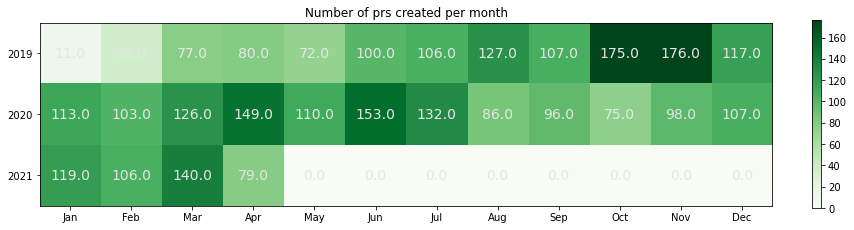

## Number of PRS per month

    Text(0.5, 1.0, 'Number of prs created per month')

    

    

    None

    

    

    

    

# PR per repositories

<table border="1" class="dataframe">
  <thead>
    <tr style="text-align: right;">
      <th></th>
      <th></th>
      <th>number</th>
    </tr>
    <tr>
      <th>org</th>
      <th>repo</th>
      <th></th>
    </tr>
  </thead>
  <tbody>
    <tr>
      <th rowspan="8" valign="top">apache</th>
      <th>ozone-docker-testkrb5</th>
      <td>1</td>
    </tr>
    <tr>
      <th>ozone-docker-builder</th>
      <td>2</td>
    </tr>
    <tr>
      <th>ozone-docker-runner</th>
      <td>5</td>
    </tr>
    <tr>
      <th>ozone-go</th>
      <td>6</td>
    </tr>
    <tr>
      <th>ozone-site</th>
      <td>6</td>
    </tr>
    <tr>
      <th>ozone-docker</th>
      <td>18</td>
    </tr>
    <tr>
      <th>hadoop</th>
      <td>773</td>
    </tr>
    <tr>
      <th>ozone</th>
      <td>2165</td>
    </tr>
  </tbody>
</table>

