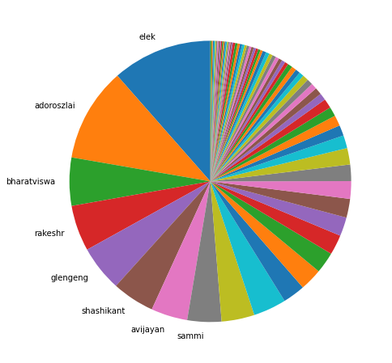
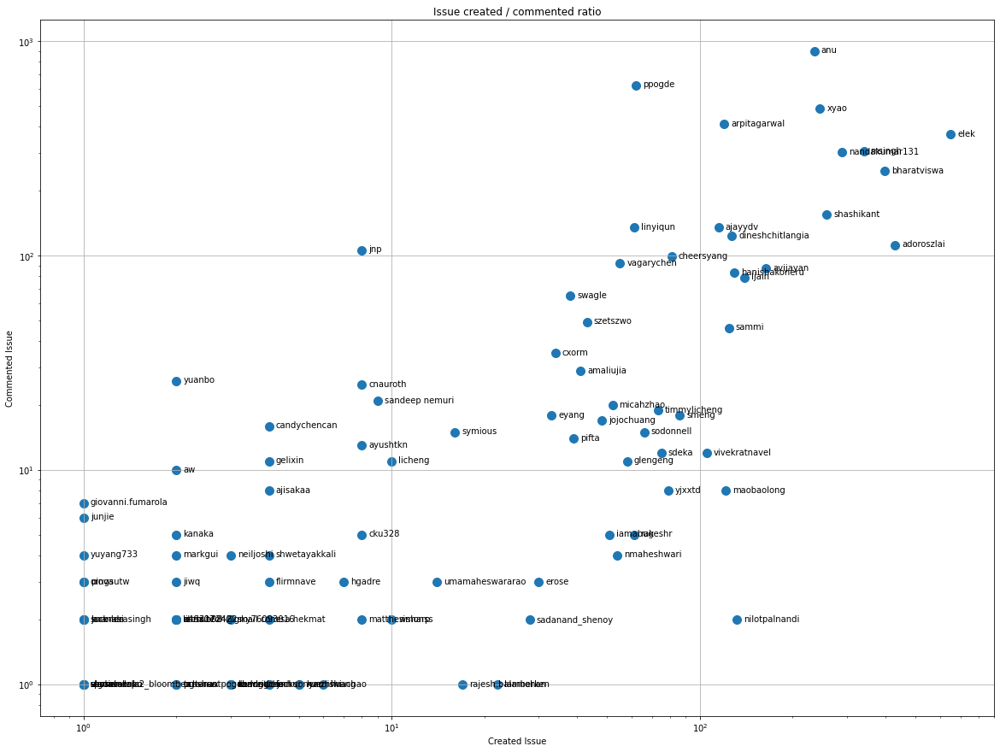
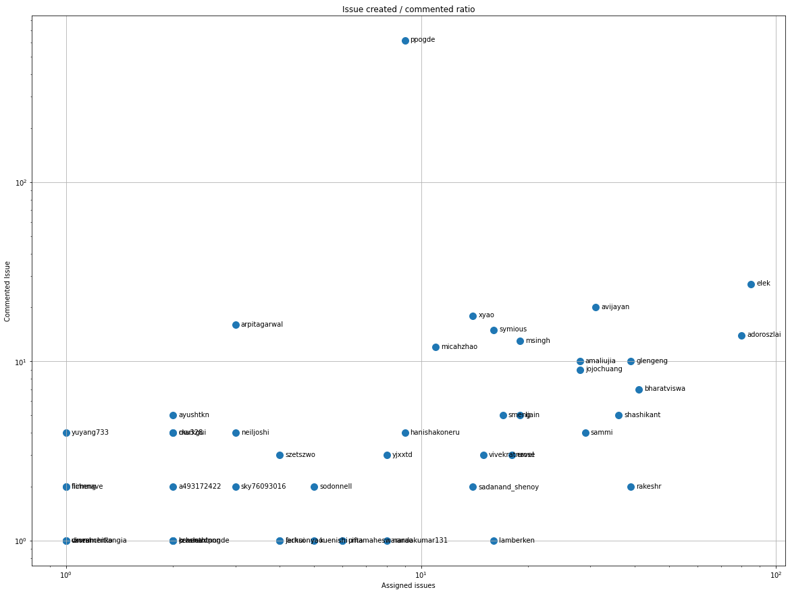
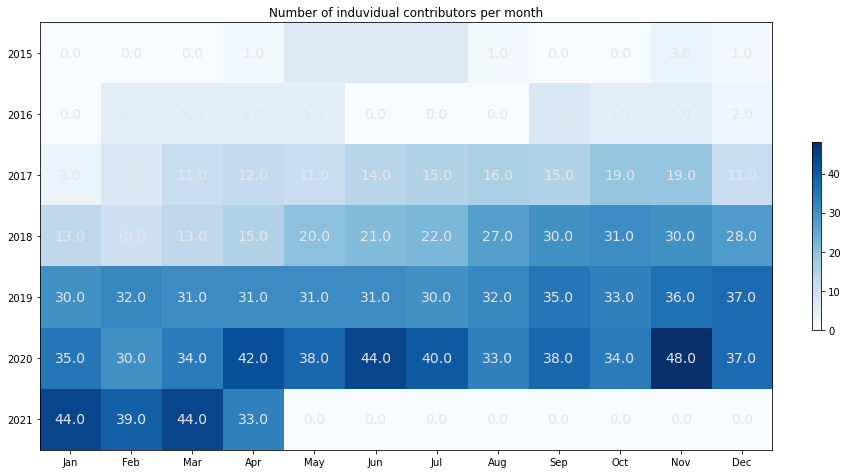
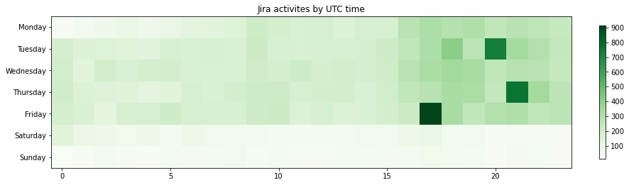

<table border="1" class="dataframe">
  <thead>
    <tr style="text-align: right;">
      <th></th>
      <th>contributions</th>
    </tr>
    <tr>
      <th>author</th>
      <th></th>
    </tr>
  </thead>
  <tbody>
    <tr>
      <th>hadoopqa</th>
      <td>3115</td>
    </tr>
    <tr>
      <th>hudson</th>
      <td>2464</td>
    </tr>
    <tr>
      <th>anu</th>
      <td>1837</td>
    </tr>
    <tr>
      <th>genericqa</th>
      <td>1130</td>
    </tr>
    <tr>
      <th>xyao</th>
      <td>894</td>
    </tr>
    <tr>
      <th>elek</th>
      <td>754</td>
    </tr>
    <tr>
      <th>arpitagarwal</th>
      <td>643</td>
    </tr>
    <tr>
      <th>ppogde</th>
      <td>628</td>
    </tr>
    <tr>
      <th>nandakumar131</th>
      <td>585</td>
    </tr>
    <tr>
      <th>msingh</th>
      <td>559</td>
    </tr>
  </tbody>
</table>

## Contributors per participations in JIRA which are not created by self (commenting/helping JIRA)

<table border="1" class="dataframe">
  <thead>
    <tr style="text-align: right;">
      <th></th>
      <th>identifier</th>
    </tr>
    <tr>
      <th>author</th>
      <th></th>
    </tr>
  </thead>
  <tbody>
    <tr>
      <th>hudson</th>
      <td>1904</td>
    </tr>
    <tr>
      <th>hadoopqa</th>
      <td>1127</td>
    </tr>
    <tr>
      <th>anu</th>
      <td>899</td>
    </tr>
    <tr>
      <th>ppogde</th>
      <td>623</td>
    </tr>
    <tr>
      <th>xyao</th>
      <td>484</td>
    </tr>
    <tr>
      <th>arpitagarwal</th>
      <td>411</td>
    </tr>
    <tr>
      <th>elek</th>
      <td>368</td>
    </tr>
    <tr>
      <th>genericqa</th>
      <td>356</td>
    </tr>
    <tr>
      <th>msingh</th>
      <td>306</td>
    </tr>
    <tr>
      <th>nandakumar131</th>
      <td>303</td>
    </tr>
    <tr>
      <th>bharatviswa</th>
      <td>247</td>
    </tr>
    <tr>
      <th>shashikant</th>
      <td>155</td>
    </tr>
    <tr>
      <th>ajayydv</th>
      <td>135</td>
    </tr>
    <tr>
      <th>linyiqun</th>
      <td>135</td>
    </tr>
    <tr>
      <th>dineshchitlangia</th>
      <td>123</td>
    </tr>
    <tr>
      <th>adoroszlai</th>
      <td>112</td>
    </tr>
    <tr>
      <th>jnp</th>
      <td>106</td>
    </tr>
    <tr>
      <th>cheersyang</th>
      <td>99</td>
    </tr>
    <tr>
      <th>vagarychen</th>
      <td>92</td>
    </tr>
    <tr>
      <th>avijayan</th>
      <td>87</td>
    </tr>
  </tbody>
</table>

## Contributors per participations in any issue

<table border="1" class="dataframe">
  <thead>
    <tr style="text-align: right;">
      <th></th>
      <th>identifier</th>
    </tr>
    <tr>
      <th>author</th>
      <th></th>
    </tr>
  </thead>
  <tbody>
    <tr>
      <th>hudson</th>
      <td>1904</td>
    </tr>
    <tr>
      <th>anu</th>
      <td>1134</td>
    </tr>
    <tr>
      <th>hadoopqa</th>
      <td>1127</td>
    </tr>
    <tr>
      <th>elek</th>
      <td>1019</td>
    </tr>
    <tr>
      <th>xyao</th>
      <td>729</td>
    </tr>
    <tr>
      <th>ppogde</th>
      <td>685</td>
    </tr>
    <tr>
      <th>msingh</th>
      <td>646</td>
    </tr>
    <tr>
      <th>bharatviswa</th>
      <td>645</td>
    </tr>
    <tr>
      <th>nandakumar131</th>
      <td>592</td>
    </tr>
    <tr>
      <th>adoroszlai</th>
      <td>541</td>
    </tr>
    <tr>
      <th>arpitagarwal</th>
      <td>531</td>
    </tr>
    <tr>
      <th>shashikant</th>
      <td>413</td>
    </tr>
    <tr>
      <th>genericqa</th>
      <td>356</td>
    </tr>
    <tr>
      <th>avijayan</th>
      <td>251</td>
    </tr>
    <tr>
      <th>dineshchitlangia</th>
      <td>250</td>
    </tr>
    <tr>
      <th>ajayydv</th>
      <td>250</td>
    </tr>
    <tr>
      <th>ljain</th>
      <td>218</td>
    </tr>
    <tr>
      <th>hanishakoneru</th>
      <td>212</td>
    </tr>
    <tr>
      <th>linyiqun</th>
      <td>196</td>
    </tr>
    <tr>
      <th>cheersyang</th>
      <td>180</td>
    </tr>
  </tbody>
</table>

# Bus factor (number of contributors responsible for the 50% of the issue creations) from last half year

## Contributors until the half of the all contributions

<table border="1" class="dataframe">
  <thead>
    <tr style="text-align: right;">
      <th></th>
      <th>author</th>
      <th>identifier</th>
      <th>cs</th>
      <th>ratio</th>
    </tr>
  </thead>
  <tbody>
    <tr>
      <th>0</th>
      <td>elek</td>
      <td>85</td>
      <td>85</td>
      <td>11.470985</td>
    </tr>
    <tr>
      <th>1</th>
      <td>adoroszlai</td>
      <td>80</td>
      <td>165</td>
      <td>10.796221</td>
    </tr>
    <tr>
      <th>2</th>
      <td>bharatviswa</td>
      <td>41</td>
      <td>206</td>
      <td>5.533063</td>
    </tr>
    <tr>
      <th>3</th>
      <td>rakeshr</td>
      <td>39</td>
      <td>245</td>
      <td>5.263158</td>
    </tr>
    <tr>
      <th>4</th>
      <td>glengeng</td>
      <td>39</td>
      <td>284</td>
      <td>5.263158</td>
    </tr>
    <tr>
      <th>5</th>
      <td>shashikant</td>
      <td>36</td>
      <td>320</td>
      <td>4.858300</td>
    </tr>
    <tr>
      <th>6</th>
      <td>avijayan</td>
      <td>31</td>
      <td>351</td>
      <td>4.183536</td>
    </tr>
  </tbody>
</table>

## Pony number (bus factor)

    8

## Dev power (All the contributions in the ration of the top contributor)

    8.717647058823529

    

    

## People with created JIRAs > commented JIRA

    

    

## Same graph with focusing to the last 6 month

Only contributors with both created pr and helped pr visible

    

    

# Number of individual contributors per month

Number of different Jira users who either created ssue or commented Issue

    Text(0.5, 1.0, 'Number of induvidual contributors per month')

    

    

# JIRA activity heatmap

    

    

