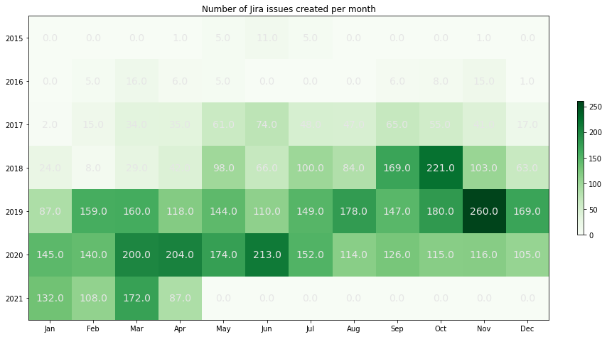
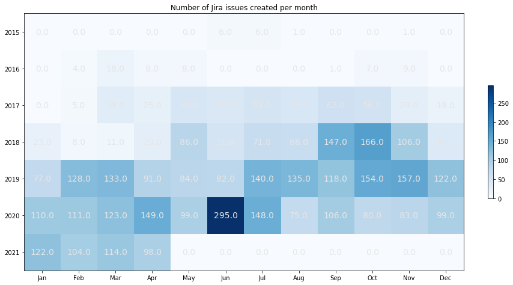

    (5750, 14)

## Number of Jira issues created per month

    Text(0.5, 1.0, 'Number of Jira issues created per month')

    

    

## Number of Jira issues created per month

    Text(0.5, 1.0, 'Number of Jira issues created per month')

    

    

## Resolution types

<table border="1" class="dataframe">
  <thead>
    <tr style="text-align: right;">
      <th></th>
      <th>key</th>
    </tr>
    <tr>
      <th>resolution</th>
      <th></th>
    </tr>
  </thead>
  <tbody>
    <tr>
      <th>Fixed</th>
      <td>3862</td>
    </tr>
    <tr>
      <th>Duplicate</th>
      <td>264</td>
    </tr>
    <tr>
      <th>Not A Problem</th>
      <td>105</td>
    </tr>
    <tr>
      <th>Implemented</th>
      <td>78</td>
    </tr>
    <tr>
      <th>Done</th>
      <td>77</td>
    </tr>
    <tr>
      <th>Won't Fix</th>
      <td>59</td>
    </tr>
    <tr>
      <th>Cannot Reproduce</th>
      <td>39</td>
    </tr>
    <tr>
      <th>Resolved</th>
      <td>33</td>
    </tr>
    <tr>
      <th>Invalid</th>
      <td>32</td>
    </tr>
    <tr>
      <th>Won't Do</th>
      <td>25</td>
    </tr>
    <tr>
      <th>Not A Bug</th>
      <td>17</td>
    </tr>
    <tr>
      <th>Abandoned</th>
      <td>17</td>
    </tr>
    <tr>
      <th>Later</th>
      <td>14</td>
    </tr>
    <tr>
      <th>Information Provided</th>
      <td>2</td>
    </tr>
    <tr>
      <th>Incomplete</th>
      <td>2</td>
    </tr>
    <tr>
      <th>Pending Closed</th>
      <td>1</td>
    </tr>
    <tr>
      <th>Auto Closed</th>
      <td>1</td>
    </tr>
    <tr>
      <th>Workaround</th>
      <td>1</td>
    </tr>
    <tr>
      <th>Works for Me</th>
      <td>1</td>
    </tr>
  </tbody>
</table>

